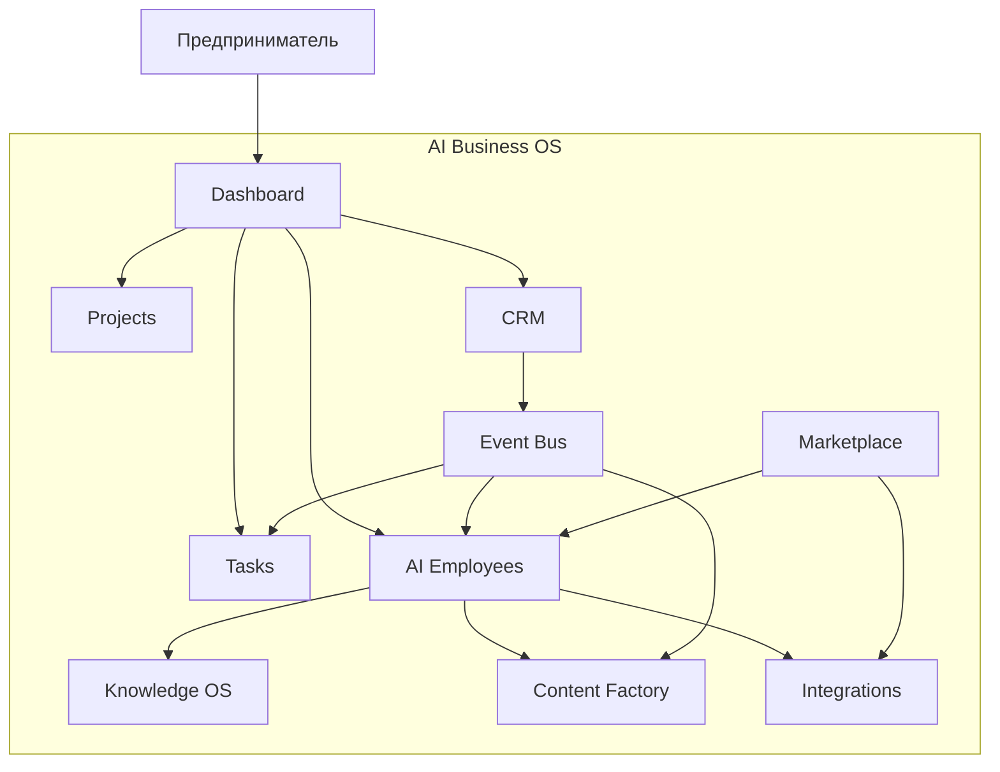
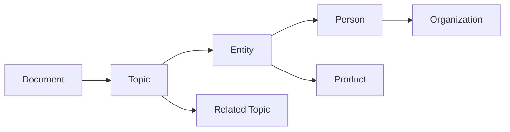
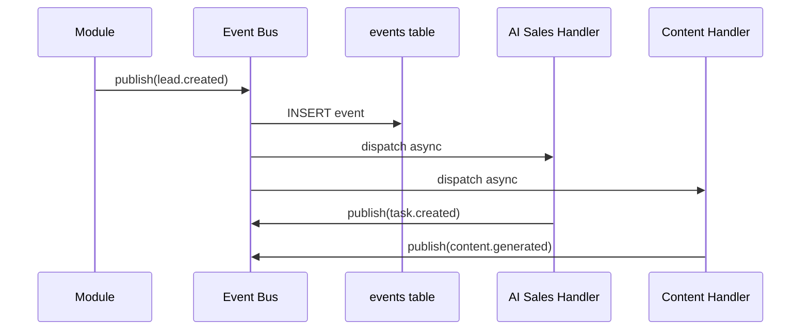

# AI Business OS — Master Architecture

> **Версия документа:** 1.0.0  
> **Статус:** Утверждён как единственный источник истины (SSOT)  
> **Аудитория:** Product, Engineering, Design, AI Agents (Cursor)  
> **Язык:** русский (термины и код — английский)  
> **Последнее обновление:** 2026-06-27

---

## Оглавление

1. [Vision](#1-vision)
2. [Главная идея](#2-главная-идея)
3. [Все основные модули](#3-все-основные-модули)
4. [Knowledge OS](#4-knowledge-os)
5. [AI Reverse Engineer](#5-ai-reverse-engineer)
6. [AI Employees](#6-ai-employees)
7. [Event Bus](#7-event-bus)
8. [CRM](#8-crm)
9. [Content Factory](#9-content-factory)
10. [Integrations](#10-integrations)
11. [Marketplace](#11-marketplace)
12. [Monetization](#12-monetization)
13. [Roadmap](#13-roadmap)
14. [Design System](#14-design-system)
15. [Engineering Rules](#15-engineering-rules)
- [Приложения](#приложения)

---

# 1. Vision

## 1.1 Что такое AI Business OS

**AI Business OS** — это операционная система для предпринимателя и команды, в которой искусственный интеллект встроен не как «чат с GPT», а как **полноценный слой управления бизнесом**: люди, AI-сотрудники, процессы, данные, контент, интеграции и аналитика работают в одной среде.

Платформа объединяет:

- **CRM и операционное управление** (лиды, сделки, задачи, проекты)
- **AI-сотрудников** с ролями, памятью, инструментами и конфигурацией
- **Knowledge OS** — систему знаний и обучения AI на материалах бизнеса
- **Content Factory** — производство контента для всех каналов
- **Automation & Event Bus** — событийную архитектуру вместо разрозненных сценариев
- **Marketplace** — экосистему шаблонов, сотрудников и интеграций
- **Integrations** — единый слой подключения внешних сервисов

AI Business OS — это **не продукт одной функции**. Это **операционная среда**, в которой бизнес живёт, принимает решения, производит контент, продаёт, анализирует и масштабируется.

## 1.2 Какую проблему решает

### Проблема фрагментации

Современный предприниматель использует 15–40 инструментов одновременно:

| Область | Типичные инструменты | Проблема |
|---------|---------------------|----------|
| CRM | amoCRM, Bitrix, HubSpot | Данные не связаны с AI |
| Задачи | Notion, ClickUp, Trello | Нет контекста бизнеса |
| Контент | Canva, ChatGPT, планировщики | Ручной перенос между каналами |
| AI | ChatGPT, Claude, Gemini | Нет памяти бизнеса, нет ролей |
| Автоматизация | Make, n8n, Zapier | Хрупкие сценарии без единого контекста |
| Аналитика | Google Sheets, Metabase | Оторвана от действий |
| Файлы | Drive, Dropbox | Не индексируются для AI |

**Результат:** потеря контекста, дублирование работы, «AI как игрушка», а не как сотрудник.

### Проблема «AI без операционной системы»

ChatGPT и аналоги решают **точечные запросы**, но не:

- не знают структуру вашей компании;
- не помнят CRM-историю;
- не выполняют цепочки действий в бизнес-процессах;
- не координируются между собой как команда;
- не имеют единого Event Bus и audit trail.

### Проблема масштабирования одного founder'а

Один предприниматель физически не может быть одновременно:

- CEO, маркетологом, копирайтером, дизайнером, sales, аналитиком, юристом, HR.

AI Business OS даёт **цифровую команду** с ролями, правами, памятью и автоматизацией — без найма 10 человек на старте.

## 1.3 Почему отличается от обычных CRM

| Критерий | Обычная CRM | AI Business OS |
|----------|-------------|----------------|
| Центр системы | Контакты и сделки | Операционная система бизнеса |
| AI | Бolt-on чат или нет | AI-сотрудники как first-class citizens |
| Контент | Нет или минимально | Content Factory встроен |
| Знания | Нет | Knowledge OS + Graph |
| Автоматизация | Простые триггеры | Event Bus + AI-агенты |
| Команда | Люди + иногда боты | Люди + AI Employees + Marketplace |
| Контекст | Силосы модулей | Единый tenant + org memory |

CRM в AI Business OS — **модуль**, а не **вся платформа**.

## 1.4 Почему отличается от ChatGPT

| ChatGPT | AI Business OS |
|---------|----------------|
| Универсальный чат | Ролевые AI-сотрудники |
| Нет CRM | CRM + Tasks + Projects |
| Нет multi-tenant | Organizations + RLS |
| Нет Event Bus | Событийная оркестрация |
| Нет Content Factory | Мульти-канальный контент |
| Общая память (ограниченная) | Knowledge OS + org memory |
| Нет Marketplace | Экосистема шаблонов |
| Нет бизнес-процессов | Automation + Integrations |

ChatGPT — **инструмент ответа на вопрос**.  
AI Business OS — **среда выполнения работы**.

## 1.5 Почему отличается от Make, n8n, Zapier

| Automation platforms | AI Business OS |
|---------------------|----------------|
| IF-THEN сценарии | Event Bus + AI reasoning |
| Нет «сотрудников» | AI Employees с ролями |
| Нет CRM/контента | Полный business stack |
| Хрупкие интеграции | Unified Integration Layer |
| Нет Knowledge Graph | Knowledge OS |
| Разработчик = пользователь | Предприниматель = пользователь |

Make/n8n/Zapier автоматизируют **передачу данных**.  
AI Business OS автоматизирует **принятие решений и выполнение работы**.

## 1.6 Целевая аудитория

- **Solo founders** — один человек + AI-команда
- **Малый бизнес** — 2–20 человек + AI-сотрудники
- **Агентства** — white-label, несколько клиентов (Enterprise)
- **Контент-креаторы** — Content Factory + Knowledge OS
- **E-commerce / Marketplace sellers** — CRM + Avito + аналитика

## 1.7 Принципы продукта

1. **AI-native, not AI-bolted** — AI встроен в архитектуру, не прикручен сбоку
2. **Organization-first** — все данные изолированы по tenant (RLS)
3. **Event-driven** — модули связаны событиями, не прямыми вызовами
4. **Human + AI parity** — AI-сотрудник = сущность с правами, задачами, памятью
5. **Composable** — модули включаются по мере роста (Marketplace)
6. **Explainable** — каждое AI-действие логируется и объяснимо
7. **Security by default** — RLS, audit, secrets server-side only

---

# 2. Главная идея

## 2.1 Операционная система предпринимателя

AI Business OS — это **OS**, а не приложение.

Аналогия:

```
Windows/macOS          →  AI Business OS
Приложения (Excel)     →  Модули (CRM, Content Factory)
Процессы               →  Event Bus + Automation
Пользователи           →  Profiles + Organization Members
Фоновые службы         →  AI Employees
Файловая система       →  Knowledge OS + Files
Драйверы               →  Integrations
App Store              →  Marketplace
```

## 2.2 Не набор нейросетей

Пользователь не выбирает «модель GPT-4 или Claude».  
Пользователь нанимает **AI Sales Manager**, который внутри использует нужный provider/model через `ai_providers` / `ai_models`.

## 2.3 Не генератор контента

Content Factory — один из модулей.  
Главная ценность — **связь контента с CRM, задачами, аналитикой и AI-командой**.

## 2.4 Не CRM

CRM — модуль для revenue operations.  
Платформа управляет **всем бизнесом**: стратегия, продукт, маркетинг, продажи, финансы, HR.

## 2.5 Единая система управления бизнесом



## 2.6 Ключевые сущности платформы

| Сущность | Описание |
|----------|----------|
| Organization | Tenant — изолированный бизнес |
| Profile | Человек (связан с auth.users) |
| Organization Member | Человек в org с ролью owner/admin/member |
| Project | Контейнер работы внутри org |
| AI Employee | Цифровой сотрудник с ролью, model, configuration |
| Task | Единица работы |
| CRM Lead | Потенциальный клиент (MVP) |
| Knowledge Node | Узел Knowledge Graph |
| Event | Событие Event Bus |
| Integration | Подключение внешнего сервиса |

---

# 3. Все основные модули

> Каждый модуль описан по шаблону: **Назначение → Пользователь → Сущности → AI-участие → Event Bus → MVP scope → v1/v2/v3**

---

## 3.1 Dashboard

### Назначение
Единая точка входа. Обзор бизнеса в реальном времени.

### Что показывает
- KPI: лиды, сделки, задачи, контент, AI-активность
- Лента Event Bus (последние события)
- Задачи на сегодня (человек + AI)
- AI Employees status (active/inactive)
- Быстрые действия: «Создать лид», «Запустить контент», «Спросить CEO AI»

### MVP
- Статичные виджеты + данные из projects/tasks/crm_leads
- Без кастомизации layout

### v1.0
- Настраиваемые виджеты
- AI-generated daily briefing

### v2.0+
- Predictive analytics
- Anomaly detection

---

## 3.2 CRM

> Подробно — [Раздел 8](#8-crm)

MVP: `crm_leads` + базовый pipeline.  
v1.0: deals, contacts, companies, history.

---

## 3.3 AI Employees

> Подробно — [Раздел 6](#6-ai-employees)

MVP: CRUD ai_employees, provider/model FK, configuration jsonb.  
v1.0: chat interface, task assignment, memory.

---

## 3.4 Projects

### Назначение
Контейнер для работы: продукт, кампания, клиент, направление.

### Сущности (MVP — реализовано в A3 schema)
- `projects`: name, description, icon, color, status (enum)

### Связи
- projects → tasks, ai_employees, crm_leads

### AI-участие
- AI Project Manager назначается на project
- AI анализирует прогресс tasks

---

## 3.5 Tasks

### Назначение
Операционные единицы работы для людей и AI.

### Сущности (MVP)
- `tasks`: title, description, status, assigned_to, ai_employee_id

### Workflow
```
todo → in_progress → done | cancelled
```

### Event Bus
- `task.created` → notify assigned AI/human
- `task.completed` → trigger Content Factory / CRM update

---

## 3.6 Content Factory

> Подробно — [Раздел 9](#9-content-factory)

---

## 3.7 Knowledge OS

> Подробно — [Раздел 4](#4-knowledge-os)

---

## 3.8 AI Clone

### Назначение
Цифровой двойник основателя: голос, стиль, знания, решения.

### Компоненты
- Voice clone (TTS trained on samples)
- Writing style (из Knowledge OS)
- Decision patterns (из истории задач/CRM)
- Avatar / video presence

### MVP
- Не входит. Placeholder в roadmap v2.0.

### v2.0
- Style extraction из Telegram/YouTube
- Voice synthesis integration

### v3.0
- Real-time video avatar
- Autonomous representative mode (с approval gates)

---

## 3.9 AI Academy

### Назначение
Обучение пользователя работе с платформой и AI-командой.

### Содержание
- Интерактивные курсы
- Playbooks по ролям AI Employees
- Certification для Marketplace creators

### MVP
- Документация + onboarding wizard

### v1.0
- Встроенные курсы
- Progress tracking

---

## 3.10 Marketplace

> Подробно — [Раздел 11](#11-marketplace)

---

## 3.11 Integrations

> Подробно — [Раздел 10](#10-integrations)

---

## 3.12 Analytics

### Назначение
Бизнес-аналитика: CRM, контент, AI usage, финансы.

### MVP
- Basic counts на Dashboard

### v1.0
- Funnels, conversion rates
- AI employee performance metrics

### v2.0
- Cohort analysis
- Predictive lead scoring

### Event Bus
- `analytics.report_requested` → AI Analyst генерирует отчёт

---

## 3.13 Finance

### Назначение
Учёт доходов/расходов, интеграция с CRM deals.

### MVP
- Не входит

### v1.0
- Basic income/expense tracking
- AI Financial Analyst summaries

### v2.0
- Invoicing
- Tax preparation assist (AI Tax Consultant)

---

## 3.14 Notifications

### Назначение
Единый центр уведомлений: in-app, email, Telegram, push.

### Каналы
- In-app notification center
- Email (transactional)
- Telegram bot
- Web push (v1.0)

### Event Bus
- Все `*.created`, `*.assigned`, `*.completed` → notification pipeline

### MVP
- In-app only

---

## 3.15 Automation

### Назначение
Визуальный и AI-assisted конструктор автоматизаций поверх Event Bus.

### Отличие от Make/n8n
- Нативные триггеры платформы (не webhook-only)
- AI может **предложить** automation из паттернов поведения
- Доступ к org context и Knowledge OS

### MVP
- Hardcoded automations через Event Bus handlers

### v1.0
- Visual builder (базовый)
- Templates из Marketplace

---

## 3.16 Event Bus

> Подробно — [Раздел 7](#7-event-bus)

---

## 3.17 Prompt Library

### Назначение
Централизованное хранилище промптов: системные, ролевые, проектные.

### Структура
- Global prompts (platform)
- Organization prompts
- AI Employee prompts (→ configuration.prompts)
- Project prompts
- Marketplace prompts

### Versioning
- semver на prompt templates
- diff и rollback

### MVP
- Prompts внутри ai_employees.configuration

### v1.0
- Prompt Library UI
- Share через Marketplace

---

## 3.18 AI Memory

### Назначение
Долгосрочная память AI-сотрудников: факты, предпочтения, история решений.

### Уровни памяти
| Уровень | Scope | Пример |
|---------|-------|--------|
| Session | Текущий чат | Контекст диалога |
| Employee | AI Employee | Стиль общения с клиентом X |
| Project | Project | Требования продукта |
| Organization | Org | Бренд-гайд, ICP |
| User | Profile | Личные предпочтения founder'а |

### Хранение
- Vector store (pgvector / Supabase)
- Structured facts table
- Связь с Knowledge Graph

### MVP
- configuration.memory jsonb placeholder

### v1.0
- Vector search + memory write/read API

---

## 3.19 Files

### Назначение
Файловое хранилище org: документы, медиа, экспорты.

### Storage
- Supabase Storage
- RLS по organization_id
- Metadata в Postgres

### AI
- Auto-indexing в Knowledge OS при upload
- OCR для PDF/изображений

### MVP
- Не входит (A3+)

### v1.0
- Upload/download
- Folder structure

---

## 3.20 Voice

### Назначение
Голосовой интерфейс: TTS, STT, voice commands, AI Voice Assistant.

### Use cases
- Голосовые заметки → Tasks
- Озвучка контента (Content Factory)
- Голосовой clone (AI Clone module)

### Integrations
- OpenAI Whisper, TTS
- ElevenLabs (v1.0)
- Native browser APIs (MVP experiments)

---

## 3.21 Video

### Назначение
Генерация и редактирование видео: reels, shorts, explainers.

### Pipeline
```
Script (AI Copywriter)
→ Storyboard (AI Designer)
→ Generation (Runway/Pika/Veo)
→ Edit (CapCut integration)
→ Publish (Content Factory)
```

### MVP
- Не входит

### v1.0
- Script + storyboard
- External generation via integrations

---

## 3.22 Image Studio

### Назначение
Генерация изображений: посты, обложки, ads, product shots.

### Models
- Stability, DALL-E, Midjourney (via integrations)
- Brand-consistent style через Knowledge OS

### MVP
- Не входит

---

## 3.23 Presentation Studio

### Назначение
AI-generated presentations: pitch decks, reports, proposals.

### Output
- PDF, PPTX, Google Slides (integration)
- Speaker notes
- Design system compliant

### AI Employee
- Presentation Designer

---

## 3.24 Website Builder

### Назначение
Генерация landing pages и сайтов из описания бизнеса.

### MVP
- Не входит

### v2.0
- AI-generated static sites
- Export to Tilda/WordPress

---

## 3.25 Funnel Builder

### Назначение
Воронки продаж: landing → lead magnet → email sequence → CRM.

### Связи
- CRM leads auto-creation
- Content Factory для каждого этапа
- Analytics conversion tracking

### MVP
- Не входит

### v2.0
- Template funnels в Marketplace

---

# 4. Knowledge OS

## 4.1 Назначение

Knowledge OS — система **накопления, структурирования и использования знаний** организации для обучения AI-сотрудников.

Цель: AI знает **ваш** бизнес, а не только интернет.

## 4.2 Knowledge Graph

После импорта любого материала система строит **Knowledge Graph**:



### Типы узлов
- **Document** — исходный материал
- **Chunk** — фрагмент для embedding
- **Topic** — тема/кластер
- **Entity** — именованная сущность (person, company, product, concept)
- **Relationship** — связь между узлами
- **Insight** — AI-generated вывод

### Типы рёбер
- `contains` (Document → Chunk)
- `mentions` (Chunk → Entity)
- `related_to` (Topic ↔ Topic)
- `authored_by` (Document → Person)
- `supports` (Insight → Topic)

## 4.3 Pipeline импорта

```
Import Source
    ↓
Parser (format-specific)
    ↓
Normalizer (plain text + metadata)
    ↓
Chunker (semantic splits)
    ↓
Embedder (vector)
    ↓
Entity Extractor (AI NER)
    ↓
Graph Builder
    ↓
Index (vector + graph + full-text)
```

## 4.4 Источники импорта

### Telegram Export
- **Формат:** JSON export из Telegram Desktop
- **Parser:** messages[], media[], forwards
- **Metadata:** channel name, date, views, reactions
- **Use case:** анализ tone of voice, best posts, audience

### VK Export
- **Формат:** JSON / API export
- **Parser:** posts, comments, groups
- **Use case:** SMM strategy extraction

### YouTube
- **Input:** URL канала / playlist / video
- **Pipeline:** transcript (auto-captions or Whisper) → chunks
- **Metadata:** views, likes, publish date, tags
- **Use case:** content strategy, topic clusters

### PDF
- **Parser:** text extraction + OCR fallback
- **Structure:** headings, pages, tables
- **Use case:** books, reports, manuals

### DOCX
- **Parser:** structured text, styles, tables
- **Use case:** internal docs, templates

### HTML
- **Parser:** readability extraction
- **Input:** URL or file upload
- **Use case:** blog posts, landing pages

### Websites
- **Crawler:** sitemap-aware, depth-limited
- **Respect:** robots.txt
- **Use case:** competitor analysis, own site indexing

### Books
- **Formats:** PDF, EPUB, FB2
- **Pipeline:** chapter detection → chunking
- **Use case:** methodology extraction

### ZIP
- **Contents:** mixed formats
- **Pipeline:** recursive unpack → route to parsers

### Audio
- **Pipeline:** STT (Whisper) → text → standard pipeline
- **Formats:** mp3, wav, m4a, ogg

### Video
- **Pipeline:** extract audio → STT OR extract subtitles → pipeline
- **Formats:** mp4, mov, webm

## 4.5 Хранение (future schema)

> Не входит в MVP A3. Документируется для roadmap.

| Таблица | Назначение |
|---------|------------|
| knowledge_sources | Импортированный источник |
| knowledge_documents | Нормализованный документ |
| knowledge_chunks | Chunks + embeddings |
| knowledge_entities | NER entities |
| knowledge_relationships | Graph edges |
| knowledge_insights | AI-generated insights |

## 4.6 RLS

Все knowledge_* таблицы — `organization_id` + `get_user_role()`.

## 4.7 AI Employees + Knowledge OS

Каждый AI Employee может иметь:
- `knowledge_scope`: project | organization | custom collection
- `retrieval_config`: top_k, filters, reranking

При запросе AI Employee:
1. Query embedding
2. Vector search в scope
3. Graph expansion (related entities)
4. Context injection в prompt

---

# 5. AI Reverse Engineer

## 5.1 Назначение

Модуль **обратной инженерии успеха**: анализ чужих (и своих) проектов для извлечения стратегий, паттернов и actionable insights.

## 5.2 Что анализирует

| Источник | Извлекаем |
|----------|-----------|
| Telegram-каналы | Tone, frequency, engagement, topics, hooks |
| Сайты | Offer, positioning, funnel, copy patterns |
| YouTube | Content pillars, thumbnails strategy, retention patterns |
| Блоги | SEO topics, article structure, CTAs |
| Книги | Frameworks, methodologies, key ideas |

## 5.3 Outputs

### Стратегия автора
- Positioning statement
- Target audience profile
- Content pillars (3–7)
- Publishing cadence
- Monetization model hypothesis

### Лучшие посты
- Top N by engagement
- Pattern analysis: hooks, length, format, CTAs
- Replicable templates

### Лучшие офферы
- Value proposition breakdown
- Price anchoring patterns
- Urgency/scarcity tactics
- Objection handling

### Вирусные темы
- Topic clusters with high engagement velocity
- Trend detection
- Recommended angles для Content Factory

## 5.4 Pipeline

```
Source URL / Export
    ↓
Knowledge OS Import
    ↓
AI Reverse Engineer Agent (Researcher + Analyst roles)
    ↓
Structured Report (JSON + Markdown)
    ↓
Actionable Items → Tasks / Content Factory / CRM
```

## 5.5 AI Employees involved
- **Researcher** — сбор данных
- **Data Analyst** — метрики и patterns
- **Marketing Director** — стратегия
- **Copywriter** — шаблоны постов

## 5.6 MVP
- Не входит в MVP
- v1.0: Telegram + Website analysis
- v2.0: YouTube + Books + competitive dashboards

---

# 6. AI Employees

## 6.1 Концепция

AI Employee — **first-class entity** в системе, аналог сотрудника:

- Имеет **роль** (role_title)
- Привязан к **provider + model** (FK)
- Имеет **configuration** (jsonb): prompts, temperature, tools, MCP, memory, voice, image
- Может быть назначен на **project**
- Может получать **tasks**
- Участвует в **Event Bus**
- Имеет **status** и **is_active**

## 6.2 Data model (MVP — A3)

```
ai_providers (global catalog)
ai_models (global catalog, FK provider)
ai_employees (org-scoped, FK provider + model, configuration jsonb)
```

## 6.3 Каталог ролей

### Leadership
| Роль | Назначение |
|------|------------|
| CEO | Стратегия, приоритеты, OKR |
| CTO | Архитектура, технические решения |
| Product Manager | Roadmap, requirements, user stories |

### Marketing & Content
| Роль | Назначение |
|------|------------|
| Marketing Director | Стратегия, кампании, positioning |
| Content Manager | Контент-план, календарь |
| Copywriter | Тексты, emails, ads |
| SMM Specialist | Соцсети, community |
| SEO Specialist | Organic traffic, keywords |
| Targetologist | Paid ads, audiences |
| Avitologist | Avito listings optimization |

### Creative
| Роль | Назначение |
|------|------------|
| Designer | Visual design, brand |
| Video Creator | Video scripts, editing direction |
| Motion Designer | Animation, motion graphics |
| Presentation Designer | Decks, reports |
| Prompt Engineer | Prompt optimization |

### Sales & CRM
| Роль | Назначение |
|------|------------|
| Sales Manager | Outreach, follow-ups, closing |
| CRM Manager | Pipeline hygiene, segmentation |

### Legal & Finance
| Роль | Назначение |
|------|------------|
| Lawyer | Contracts, compliance |
| Tax Consultant | Tax optimization |
| Investment Advisor | Investment analysis |
| Financial Analyst | Reports, forecasting |

### People
| Роль | Назначение |
|------|------------|
| Recruiter | Hiring pipeline |
| HR | Policies, onboarding |
| Business Coach | Founder coaching |
| Psychologist | Wellbeing (disclaimer: not medical) |

### Operations & Data
| Роль | Назначение |
|------|------------|
| Researcher | Market/competitor research |
| Data Analyst | Dashboards, insights |
| Personal Assistant | Scheduling, reminders |
| Travel Manager | Trip planning |
| Voice Assistant | Voice interface |

### Health
| Роль | Назначение |
|------|------------|
| Health Coach | Wellness programs |
| Nutritionist | Meal planning (disclaimer) |

### E-commerce
| Роль | Назначение |
|------|------------|
| Marketplace Manager | Ozon/WB/Amazon ops |

## 6.4 Custom AI Employees

Пользователь может создать **Custom AI Employee**:
- Любой role_title
- Выбор provider/model
- Полная configuration jsonb
- Avatar, color
- Publish в Marketplace (v1.0)

## 6.5 configuration jsonb schema (рекомендуемая)

```json
{
  "prompts": {
    "system": "...",
    "greeting": "...",
    "fallback": "..."
  },
  "temperature": 0.7,
  "top_p": 1.0,
  "max_tokens": 4096,
  "tools": ["crm.read", "tasks.create", "content.generate"],
  "mcp": {
    "servers": []
  },
  "memory": {
    "enabled": true,
    "scope": "organization",
    "max_facts": 1000
  },
  "voice": {
    "enabled": false,
    "provider": null,
    "voice_id": null
  },
  "image": {
    "enabled": false,
    "style_preset": null
  }
}
```

## 6.6 AI Employee lifecycle

```
Create → Configure → Assign to Project → Activate
    ↓
Receive Tasks / Events
    ↓
Execute (LLM + tools + memory)
    ↓
Log actions (audit)
    ↓
Deactivate / Archive
```

---

# 7. Event Bus

## 7.1 Назначение

Event Bus — **нервная система** платформы. Модули не вызывают друг друга напрямую — они **публикуют события** и **подписываются** на них.

## 7.2 Принципы

1. **At-least-once delivery** (с idempotency keys)
2. **Org-scoped events** — каждое событие имеет organization_id
3. **Audit trail** — все events persisted
4. **Async by default** — handlers не блокируют UI
5. **AI handlers** — AI Employees как event subscribers

## 7.3 Event schema

```json
{
  "id": "uuid",
  "organization_id": "uuid",
  "type": "lead.created",
  "version": "1.0",
  "source": "crm",
  "payload": {},
  "metadata": {
    "user_id": "uuid",
    "ai_employee_id": null,
    "correlation_id": "uuid"
  },
  "created_at": "ISO8601"
}
```

## 7.4 Event types (catalog)

### CRM
- `lead.created`
- `lead.updated`
- `lead.status_changed`
- `lead.assigned`
- `deal.created`
- `deal.won`
- `deal.lost`

### Tasks
- `task.created`
- `task.assigned`
- `task.completed`
- `task.cancelled`

### AI Employees
- `ai_employee.created`
- `ai_employee.activated`
- `ai_employee.message_received`
- `ai_employee.action_executed`

### Content
- `content.requested`
- `content.generated`
- `content.scheduled`
- `content.published`

### Knowledge
- `knowledge.import_started`
- `knowledge.import_completed`
- `knowledge.graph_updated`

### System
- `integration.connected`
- `integration.error`
- `notification.send`

## 7.5 Пример цепочки

```
[CRM] lead.created { name: "Иван", source: "landing" }
    ↓
[Event Bus] persist + dispatch
    ↓
[AI Sales Manager] subscriber → analyze lead → create follow-up task
    ↓
[Tasks] task.created { title: "Follow up Ivan", assigned_to: sales_ai }
    ↓
[Event Bus]
    ↓
[AI Copywriter] subscriber → generate email sequence
    ↓
[Content Factory] content.generated { channel: "email", sequence: 3 }
    ↓
[Event Bus]
    ↓
[AI CRM Manager] subscriber → update lead status → "contacted"
    ↓
[Event Bus]
    ↓
[AI Analytics] subscriber → update funnel metrics → generate report
```

## 7.6 Architecture



## 7.7 Implementation roadmap

| Phase | Implementation |
|-------|----------------|
| MVP | Supabase Database Webhooks + Edge Functions |
| v1.0 | Dedicated events table + worker queue |
| v2.0 | pg_notify / realtime subscriptions |
| v3.0 | External event bridge (n8n/Make export) |

## 7.8 RLS

- `events` table: org-scoped, member read, system insert
- Handlers run server-side (service_role or SECURITY DEFINER)

---

# 8. CRM

## 8.1 Назначение

CRM — модуль управления отношениями с клиентами и revenue pipeline.

## 8.2 MVP (A3 schema)

### crm_leads
| Поле | Описание |
|------|----------|
| name | Имя лида |
| email, phone | Контакты |
| status | lead_status enum |
| source | Источник |
| notes | Заметки |
| last_contact_at | Последний контакт |
| project_id | Привязка к проекту |
| assigned_to | Ответственный человек |
| created_by, updated_by | Audit |

## 8.3 v1.0 entities

### Contacts
- Person: name, email, phone, social links
- FK to company (optional)

### Companies
- name, industry, size, website
- org-scoped

### Deals
- contact/company FK
- amount, currency
- stage (pipeline)
- probability
- expected_close_date

### Pipeline stages (default)
```
new → qualified → proposal → negotiation → won | lost
```

## 8.4 History
- Activity log: calls, emails, meetings, notes
- Auto-populated from Event Bus
- Timeline UI per lead/contact/deal

## 8.5 Tasks integration
- CRM entity → linked tasks
- AI Sales auto-creates follow-up tasks

## 8.6 Comments
- Threaded comments on leads/deals
- @mentions
- AI can append summary comments

## 8.7 Reminders
- Scheduled reminders per lead
- Notification via Notifications module
- AI CRM Manager can set auto-reminders

## 8.8 AI CRM workflows

| Trigger | AI Action |
|---------|-----------|
| lead.created | Score + assign + first task |
| lead.status_changed | Update related tasks |
| deal.stale (7 days) | Alert + suggest action |
| deal.won | Trigger onboarding content |

---

# 9. Content Factory

## 9.1 Назначение

**Контент-завод** — массовое производство контента для всех каналов из единого источника (идея, Knowledge OS, CRM event).

## 9.2 One-click generation

```
Input: topic / brief / CRM event / Knowledge insight
    ↓
AI Content Manager → plan
    ↓
Parallel generation per channel
    ↓
Review queue
    ↓
Schedule / Publish
```

## 9.3 Каналы

| Канал | Формат | Особенности |
|-------|--------|-------------|
| Telegram | post, channel, bot | Markdown, emoji, length |
| VK | post, article, story | Media attachments |
| Дзен | article | Long-form, SEO title |
| LinkedIn | post, article | Professional tone |
| Threads | thread | Short, conversational |
| Pinterest | pin | Vertical image + description |
| TikTok | script + hashtags | Short video script |
| YouTube | script, description, tags | Long-form video |
| Rutube | аналог YouTube | RU audience |
| Instagram | post, reel script, story | Visual-first |

## 9.4 Content entity (future)

| Поле | Описание |
|------|----------|
| organization_id | Tenant |
| project_id | Project |
| channel | Enum |
| format | post / article / script / email |
| status | draft / review / scheduled / published |
| body | Content text |
| media_refs | Links to Files |
| scheduled_at | Publish time |
| ai_employee_id | Creator AI |
| metadata | Channel-specific JSON |

## 9.5 Brand consistency
- Pull brand voice from Knowledge OS
- Style guide enforcement via Prompt Library
- AI Designer generates matching visuals

## 9.6 MVP
- Не входит (post-MVP module)

## 9.7 v1.0
- Telegram + VK generation
- Manual copy/export

## 9.8 v2.0
- All channels
- Scheduling + integrations publish
- A/B variants

---

# 10. Integrations

## 10.1 Integration Layer architecture

```
┌─────────────────────────────────────┐
│         AI Business OS              │
│  ┌─────────────────────────────┐    │
│  │    Integration Registry     │    │
│  └─────────────┬───────────────┘    │
│                │                    │
│  ┌─────────────▼───────────────┐    │
│  │    Connection Manager       │    │
│  │  (OAuth, API keys, RLS)     │    │
│  └─────────────┬───────────────┘    │
│                │                    │
│  ┌─────────────▼───────────────┐    │
│  │    Adapter Pattern          │    │
│  │  (per-provider adapter)     │    │
│  └─────────────────────────────┘    │
└─────────────────────────────────────┘
         │         │         │
    OpenAI    Telegram    Supabase
```

## 10.2 AI Providers

| Provider | Code | Capabilities |
|----------|------|-------------|
| OpenAI | openai | GPT, DALL-E, Whisper, TTS |
| Anthropic | anthropic | Claude |
| Google Gemini | gemini | Gemini Pro/Ultra |
| Qwen | qwen | Alibaba models |
| DeepSeek | deepseek | Reasoning models |
| Perplexity | perplexity | Search-augmented |
| Grok | grok | xAI models |
| Mistral | mistral | Open models |
| Stability AI | stability | Image generation |

## 10.3 Media Generation

| Provider | Type |
|----------|------|
| Runway | Video generation |
| Pika | Video generation |
| Veo (Google) | Video generation |
| CapCut | Video editing |
| Doitong | (regional tool) |

## 10.4 Platform & Data

| Integration | Purpose |
|-------------|---------|
| Supabase | Database, Auth, Storage, Realtime |
| GitHub | Code, CI/CD |
| Google Drive | File sync |
| Google Docs | Document collaboration |
| Google Sheets | Spreadsheets, reports |
| Google Calendar | Scheduling |
| Notion | Knowledge import/export |
| Obsidian | Knowledge import |
| Airtable | Data sync |

## 10.5 Communication

| Integration | Purpose |
|-------------|---------|
| Telegram | Bot, notifications, content publish |
| VK | Social, content publish |
| WhatsApp | Business messaging |
| Discord | Community, notifications |
| Slack | Team communication |

## 10.6 Productivity

| Integration | Purpose |
|-------------|---------|
| ClickUp | Task sync |
| Trello | Board sync |
| n8n | External automation bridge |
| Make | External automation bridge |
| Zapier | External automation bridge |

## 10.7 Marketplaces & Classifieds

| Integration | Purpose |
|-------------|---------|
| Avito | Listings, leads |
| HeadHunter | Recruiting |

## 10.8 Social & Content platforms

| Integration | Purpose |
|-------------|---------|
| YouTube | Upload, analytics |
| Pinterest | Pin publishing |
| Threads | Post publishing |
| LinkedIn | Post publishing |
| Rutube | Video publishing |

## 10.9 Website builders

| Integration | Purpose |
|-------------|---------|
| WordPress | Site publish |
| Tilda | Landing publish |

## 10.10 Connection storage

- Credentials encrypted server-side
- Never exposed to browser client
- `SUPABASE_SERVICE_ROLE_KEY` only on server
- Per-org connection isolation (RLS)

## 10.11 MVP
- Supabase (done — A2)
- Manual env vars for AI providers

## 10.12 v1.0
- OAuth flow for Google, Telegram
- Connection Manager UI

---

# 11. Marketplace

## 11.1 Назначение

**AI-магазин** — экосистема расширений платформы.

## 11.2 Что можно установить

| Тип | Пример |
|-----|--------|
| AI Employee template | «AI Sales Manager Pro» |
| Prompt pack | «SaaS Cold Outreach» |
| CRM template | «B2B Pipeline» |
| Automation | «Lead → Email sequence» |
| Integration bundle | «Telegram + CRM sync» |
| Design theme | Dark Pro Theme |
| Funnel template | «Webinar funnel» |
| Knowledge pack | «SMM Playbook RU» |

## 11.3 Marketplace entities (future)

| Entity | Description |
|--------|-------------|
| marketplace_items | Listing |
| marketplace_versions | semver releases |
| marketplace_installs | Org installation record |
| marketplace_reviews | User reviews |
| marketplace_creators | Creator profiles |

## 11.4 Creator economy
- Creators publish items
- Revenue share (see Monetization)
- Review & moderation pipeline
- Certification via AI Academy

## 11.5 Installation flow

```
Browse Marketplace
    ↓
Preview (description, screenshots, reviews)
    ↓
Install → copy config to org
    ↓
Customize (optional)
    ↓
Activate
```

## 11.6 MVP
- Не входит

## 11.7 v1.0
- Curated templates (platform-owned)
- Install AI Employee templates

## 11.8 v2.0
- User-generated content
- Payments + revenue share

---

# 12. Monetization

## 12.1 Модель

Freemium + subscription tiers + usage-based AI credits + Marketplace revenue share + Enterprise/White Label.

## 12.2 Free

| Лимит | Значение |
|-------|----------|
| Organizations | 1 |
| Members | 1 |
| AI Employees | 2 |
| Projects | 1 |
| Tasks | 50 |
| CRM Leads | 100 |
| Knowledge storage | 100 MB |
| AI Credits/month | 100 |
| Integrations | 2 |
| Marketplace | browse only |

## 12.3 Pro

**Цена:** ~990–1490 ₽/мес (ориентир)

| Лимит | Значение |
|-------|----------|
| Members | 3 |
| AI Employees | 10 |
| Projects | 10 |
| AI Credits/month | 2000 |
| Knowledge storage | 5 GB |
| Integrations | 10 |
| Content Factory | basic |
| Marketplace | install |

## 12.4 Business

**Цена:** ~4990–7990 ₽/мес (ориентир)

| Лимит | Значение |
|-------|----------|
| Members | 20 |
| AI Employees | unlimited |
| Projects | unlimited |
| AI Credits/month | 10000 |
| Knowledge storage | 50 GB |
| All modules | ✓ |
| Event Bus automations | ✓ |
| Priority support | ✓ |

## 12.5 Enterprise

- Custom pricing
- SSO/SAML
- Dedicated instance option
- SLA
- Custom integrations
- Audit logs export
- Dedicated account manager

## 12.6 AI Credits

Usage-based billing для AI operations:

| Operation | Credits |
|-----------|---------|
| LLM request (small) | 1 |
| LLM request (large) | 5 |
| Image generation | 10 |
| Video generation | 50 |
| Knowledge import (per MB) | 1 |
| Voice minute | 5 |

Credits purchasable as top-up packs.

## 12.7 Marketplace revenue

- Platform fee: 20–30% on paid items
- Creator receives 70–80%
- Free items: no fee

## 12.8 Partner Program

- Referral commission: 20% recurring (12 months)
- Agency partners: white-label discount
- Integration partners: co-marketing

## 12.9 White Label

- Custom domain
- Custom branding (logo, colors)
- Remove AI Business OS branding
- Enterprise pricing tier
- Partner/agency deployment

---

# 13. Roadmap

## 13.1 Phase 0 — Foundation (DONE / IN PROGRESS)

| Task | Status | Description |
|------|--------|-------------|
| A1 | ✅ Done | Next.js, Tailwind, design tokens, ESLint, Prettier |
| A2 | ✅ Done | Supabase SSR clients, health endpoint |
| A3 | 📋 Planned | Schema + RLS (7 tables + ai_providers + ai_models) |

### A1 deliverables
- `app/`, `services/`, `styles/`, `components/` (atomic structure)
- `data-theme` dark mode
- No shadcn, no TanStack Query in foundation

### A2 deliverables
- `services/supabase/client.ts` (browser)
- `services/supabase/server.ts` (server)
- `app/api/health/route.ts`
- `.env.example`

### A3 deliverables
- 12 migration files
- RLS via `get_user_role()`
- Seed data

## 13.2 MVP (Phase 1)

**Goal:** Работающий продукт для solo founder.

| Module | Scope |
|--------|-------|
| Auth | Magic link (B2) |
| Dashboard | Basic widgets |
| Projects | CRUD |
| Tasks | CRUD + assign |
| CRM | Leads CRUD + pipeline view |
| AI Employees | CRUD + basic chat |
| Knowledge OS | PDF + Telegram import (basic) |
| Notifications | In-app |

**Timeline estimate:** 8–12 weeks post A3

## 13.3 Version 1.0 (Phase 2)

| Module | Scope |
|--------|-------|
| CRM | Deals, contacts, companies |
| Content Factory | Telegram + VK |
| Event Bus | Full event table + handlers |
| Integrations | Google, Telegram OAuth |
| Analytics | Funnels, AI metrics |
| Marketplace | Curated templates |
| Prompt Library | UI |
| AI Memory | Vector store |
| Files | Upload + indexing |

**Timeline estimate:** +12–16 weeks

## 13.4 Version 2.0 (Phase 3)

| Module | Scope |
|--------|-------|
| Content Factory | All channels |
| AI Reverse Engineer | Telegram + Website |
| AI Clone | Voice + style |
| Automation | Visual builder |
| Finance | Basic tracking |
| Video/Image Studio | Generation pipeline |
| Marketplace | User-generated |
| Funnel Builder | Templates |

**Timeline estimate:** +16–24 weeks

## 13.5 Version 3.0 (Phase 4)

| Module | Scope |
|--------|-------|
| Website Builder | AI-generated sites |
| Presentation Studio | Full pipeline |
| Enterprise | SSO, audit, SLA |
| White Label | Partner deployment |
| AI Clone | Video avatar |
| Advanced Analytics | Predictive |
| External Event Bridge | n8n/Make sync |

---

# 14. Design System

## 14.1 Philosophy

**Modern, calm, professional** — уровень Linear, Raycast, Vercel.

- Минимум визуального шума
- Контент и данные — в центре
- AI-элементы — subtle, не «sci-fi»
- Dark mode — first-class (`data-theme="dark"`)

## 14.2 Design tokens (implemented A1)

### Light (`:root`)
| Token | Value | Usage |
|-------|-------|-------|
| `--surface-0` | `#ffffff` | Page background |
| `--surface-1` | `#f7f8fb` | Card background |
| `--surface-2` | `#eef1f7` | Elevated/hover |
| `--text-primary` | `#10131a` | Headings, body |
| `--text-secondary` | `#5b6472` | Labels, meta |
| `--border-subtle` | `#dfe4ec` | Borders |
| `--accent` | `#3d4fe0` | Primary actions |
| `--accent-soft` | `#eef0ff` | Accent backgrounds |

### Dark (`[data-theme="dark"]`)
| Token | Value |
|-------|-------|
| `--surface-0` | `#0b0f1a` |
| `--surface-1` | `#111827` |
| `--surface-2` | `#1f2937` |
| `--text-primary` | `#f9fafb` |
| `--text-secondary` | `#9ca3af` |
| `--border-subtle` | `#374151` |
| `--accent` | `#7c8cff` |
| `--accent-soft` | `#1e2448` |

File: `styles/tokens.css`

## 14.3 Typography

| Level | Font | Size | Weight |
|-------|------|------|--------|
| Display | Geist Sans | 32px | 600 |
| H1 | Geist Sans | 24px | 600 |
| H2 | Geist Sans | 20px | 600 |
| H3 | Geist Sans | 16px | 600 |
| Body | Geist Sans | 14px | 400 |
| Small | Geist Sans | 12px | 400 |
| Mono | Geist Mono | 13px | 400 |

Base: 14px (compact, Linear-style)

## 14.4 Spacing scale

| Token | Value |
|-------|-------|
| `--space-1` | 4px |
| `--space-2` | 8px |
| `--space-3` | 12px |
| `--space-4` | 16px |
| `--space-5` | 20px |
| `--space-6` | 24px |
| `--space-8` | 32px |
| `--space-10` | 40px |
| `--space-12` | 48px |
| `--space-16` | 64px |

## 14.5 Border radius

| Token | Value | Usage |
|-------|-------|-------|
| `--radius-sm` | 6px | Buttons, inputs |
| `--radius-md` | 8px | Cards |
| `--radius-lg` | 12px | Modals |
| `--radius-xl` | 16px | Large panels |
| `--radius-full` | 9999px | Pills, avatars |

## 14.6 Shadows

| Token | Value |
|-------|-------|
| `--shadow-sm` | `0 1px 2px rgba(0,0,0,0.05)` |
| `--shadow-md` | `0 4px 12px rgba(0,0,0,0.08)` |
| `--shadow-lg` | `0 8px 24px rgba(0,0,0,0.12)` |

Dark mode: reduced opacity shadows.

## 14.7 Animations

| Name | Duration | Easing | Usage |
|------|----------|--------|-------|
| `--transition-fast` | 150ms | ease-out | Hover states |
| `--transition-base` | 200ms | ease-out | UI transitions |
| `--transition-slow` | 300ms | ease-in-out | Modals, panels |
| `--spring` | — | cubic-bezier(0.34, 1.56, 0.64, 1) | Playful elements |

### Principles
- Prefer `transform` and `opacity` (GPU)
- No animation > 500ms for UI feedback
- `prefers-reduced-motion` respected

## 14.8 Glassmorphism

Used sparingly for:
- Floating panels
- Command palette (Raycast-style)
- AI chat overlay

```css
/* Reference — not implemented until component phase */
background: rgba(var(--surface-1-rgb), 0.72);
backdrop-filter: blur(12px);
border: 1px solid var(--border-subtle);
```

## 14.9 3D elements

- Subtle 3D icons for AI Employees avatars
- Optional Three.js hero on landing (marketing only)
- Not used in core app UI (performance)

## 14.10 Component architecture

```
components/
├── atoms/       # Button, Input, Badge, Avatar
├── molecules/   # FormField, Card, NavItem
├── organisms/   # Sidebar, Header, DataTable
└── ai/          # AIChat, AIEmployeeCard, AIConfigPanel
```

## 14.11 Layout

```
┌──────────────────────────────────────────┐
│ Header (org switcher, search, profile)   │
├────────┬─────────────────────────────────┤
│        │                                 │
│ Sidebar│  Main Content                   │
│        │                                 │
│        │                                 │
└────────┴─────────────────────────────────┘
```

- Sidebar: 240px expanded, 64px collapsed
- Content max-width: 1200px (configurable per module)

## 14.12 Accessibility

- WCAG 2.1 AA target
- Focus visible on all interactive elements
- Color contrast ≥ 4.5:1 for text
- Keyboard navigation (Command palette: Cmd+K)

---

# 15. Engineering Rules

> **SSOT для Cursor:** все AI-агенты и разработчики обязаны следовать этому разделу.

## 15.1 Architecture rules

### Directory structure (approved)

```
ai-business-os/
├── app/                  # Next.js App Router
├── services/             # External service clients
│   └── supabase/
├── components/           # Atomic design
│   ├── atoms/
│   ├── molecules/
│   ├── organisms/
│   └── ai/
├── styles/               # Design tokens
├── utils/                # Pure utilities
├── types/                # Shared TypeScript types
├── config/               # App configuration
├── supabase/             # SQL migrations (A3+)
│   └── migrations/
├── docs/                 # Documentation (this file)
└── public/
```

### Forbidden
- ❌ `src/` directory
- ❌ shadcn/ui
- ❌ `@supabase/auth-helpers-nextjs`
- ❌ TanStack Query in foundation
- ❌ Prisma (use Supabase SQL)
- ❌ `SERVICE_ROLE` in browser client
- ❌ Business logic in `app/api/health` beyond health check

### Required patterns
- ✅ `@supabase/ssr` for all Supabase clients
- ✅ `services/supabase/client.ts` — browser (anon key only)
- ✅ `services/supabase/server.ts` — server (cookies)
- ✅ RLS on all tables — `get_user_role(org_id)`
- ✅ `data-theme="dark"` for theming (not `.dark` class)
- ✅ `suppressHydrationWarning` on `<html>`

## 15.2 Code style

### Prettier (`.prettierrc`)
```json
{
  "semi": true,
  "singleQuote": true,
  "trailingComma": "all",
  "printWidth": 100,
  "tabWidth": 2
}
```

### TypeScript
- Strict mode enabled
- No `any` without explicit comment
- Prefer `type` over `interface` for props
- Use Zod for runtime validation (when added in feature tasks)

### Naming

| Entity | Convention | Example |
|--------|------------|---------|
| Files (components) | PascalCase.tsx | `LeadCard.tsx` |
| Files (utils) | kebab-case.ts | `format-date.ts` |
| Files (services) | kebab-case.ts | `client.ts` |
| SQL tables | snake_case | `crm_leads` |
| SQL enums | snake_case | `lead_status` |
| TS variables | camelCase | `organizationId` |
| React components | PascalCase | `LeadCard` |
| Constants | UPPER_SNAKE | `MAX_LEADS` |
| Event types | dot.notation | `lead.created` |

### Imports
```typescript
// Order: external → internal absolute → relative → styles
import { NextResponse } from 'next/server';

import { createClient } from '@/services/supabase/server';
```

## 15.3 Git flow

### Branches
- `main` — production-ready
- `feat/<task>-<description>` — features
- `fix/<description>` — bug fixes

### Commits
Conventional Commits:
```
feat(crm): add lead pipeline view
fix(auth): handle expired magic link
chore(a3): add crm_leads migration
docs: update master architecture
```

Task prefix when applicable:
```
A3: add ai_providers migration
B2: magic link auth flow
```

### PR rules
- 1 task = 1 PR (preferred)
- Must pass `npm run lint` + `npm run build`
- No unrelated changes
- Architecture changes require update to this document

## 15.4 Code review checklist

- [ ] Follows directory structure
- [ ] No forbidden dependencies
- [ ] RLS not bypassed from client
- [ ] No secrets in client code
- [ ] Types correct
- [ ] Prettier compliant
- [ ] No scope creep (only task requirements)
- [ ] Migrations reversible (down migration or documented)

## 15.5 SQL rules

### Migrations
- One concern per file (see A3 migration list)
- Never edit applied migrations — create new ones
- All tables: `organization_id` where tenant-scoped
- Use PostgreSQL ENUMs for statuses
- Always enable RLS
- Use `get_user_role()` for policies

### Naming
```sql
-- Tables: plural snake_case
crm_leads

-- Enums: singular snake_case
lead_status

-- Functions: snake_case
get_user_role(org_id uuid)

-- Indexes: idx_{table}_{columns}
idx_tasks_organization_id
```

### Forbidden in migrations
- ❌ `GRANT ALL TO anon`
- ❌ Disabling RLS on tenant tables
- ❌ Storing secrets in SQL

## 15.6 RLS rules

- Every tenant table: `ENABLE ROW LEVEL SECURITY`
- Helper: `get_user_role(org_id uuid) RETURNS organization_role`
- Catalog tables (ai_providers, ai_models): SELECT for authenticated, no write
- service_role: server-side only, never in browser
- Test cross-org isolation for every new table

## 15.7 Testing

### MVP approach
- No unit test framework in A1/A2/A3
- RLS isolation: manual + seed-based SQL tests
- `npm run lint` + `npm run build` = CI gate

### v1.0 testing
- Vitest for utils/services
- pgTAP or custom SQL tests for RLS
- Playwright for critical flows (auth, CRM CRUD)

### Test naming
```
describe('getUserRole')
it('returns null for non-member')
it('returns owner for org creator')
```

## 15.8 Environment variables

| Variable | Scope | Required |
|----------|-------|----------|
| `NEXT_PUBLIC_SUPABASE_URL` | public | yes |
| `NEXT_PUBLIC_SUPABASE_ANON_KEY` | public | yes |
| `SUPABASE_SERVICE_ROLE_KEY` | server only | yes (future admin ops) |

- `.env.example` — committed, no values
- `.env.local` — never committed
- Never use SERVICE_ROLE in `services/supabase/client.ts`

## 15.9 Security

- RLS on all tenant data
- Auth via Supabase (magic link in B2)
- HTTPS only in production
- CSP headers (v1.0)
- Rate limiting on API routes (v1.0)
- Audit log for AI actions (v1.0)
- Input validation via Zod on all API inputs (feature tasks)

## 15.10 Cursor agent instructions

When implementing any task:

1. **Read this document first**
2. Check current phase in Roadmap (§13)
3. Verify task is in scope for current phase
4. Do not add dependencies forbidden in §15.1
5. Do not change architecture without updating this doc
6. Follow naming conventions (§15.2)
7. Run `npm run lint` + `npm run build` before commit
8. One task — one focused PR

---

# Приложения

## A. Database schema (MVP A3)

### Enum types
- `organization_role`
- `project_status`
- `ai_employee_status`
- `task_status`
- `lead_status`

### Tables
1. `profiles`
2. `organizations`
3. `organization_members` (composite PK)
4. `ai_providers` (global catalog)
5. `ai_models` (global catalog)
6. `projects`
7. `ai_employees`
8. `tasks`
9. `crm_leads`

### RLS
- Single helper: `get_user_role(org_id uuid)`
- Catalog tables: read-only for authenticated

### Migrations
```
001_extensions.sql
002_enums.sql
003_profiles.sql
004_organizations.sql
005_ai_providers.sql
006_ai_models.sql
007_projects.sql
008_ai_employees.sql
009_tasks.sql
010_crm_leads.sql
011_rls.sql
012_seed.sql
```

## B. Event catalog (full)

### B.1 CRM events

| Event | Payload | Subscribers |
|-------|---------|-------------|
| `lead.created` | `{ lead_id, name, source, project_id? }` | AI Sales, AI CRM, Analytics, Notifications |
| `lead.updated` | `{ lead_id, changes: {} }` | AI CRM, Analytics |
| `lead.status_changed` | `{ lead_id, from, to }` | AI Sales, Content Factory, Analytics |
| `lead.assigned` | `{ lead_id, assigned_to }` | Notifications, AI Sales |
| `lead.contacted` | `{ lead_id, channel, at }` | Analytics, AI CRM |
| `deal.created` | `{ deal_id, amount, contact_id }` | AI Sales, Finance, Analytics |
| `deal.stage_changed` | `{ deal_id, from, to }` | AI Sales, Notifications |
| `deal.won` | `{ deal_id, amount }` | Finance, Content Factory, Analytics |
| `deal.lost` | `{ deal_id, reason }` | AI Sales, Analytics |

### B.2 Task events

| Event | Payload | Subscribers |
|-------|---------|-------------|
| `task.created` | `{ task_id, title, assigned_to?, ai_employee_id? }` | Notifications, Analytics |
| `task.assigned` | `{ task_id, assigned_to, assigned_by }` | Notifications |
| `task.status_changed` | `{ task_id, from, to }` | Event Bus chains, Analytics |
| `task.completed` | `{ task_id, completed_by }` | CRM, Content Factory, Analytics |
| `task.overdue` | `{ task_id, due_at }` | Notifications, AI Assistant |

### B.3 AI Employee events

| Event | Payload | Subscribers |
|-------|---------|-------------|
| `ai_employee.created` | `{ ai_employee_id, role_title }` | Analytics |
| `ai_employee.activated` | `{ ai_employee_id }` | Dashboard |
| `ai_employee.deactivated` | `{ ai_employee_id }` | Dashboard |
| `ai_employee.message_received` | `{ ai_employee_id, session_id, preview }` | Audit log |
| `ai_employee.action_executed` | `{ ai_employee_id, action, result }` | Audit log, Analytics |
| `ai_employee.error` | `{ ai_employee_id, error, context }` | Notifications, Admin |

### B.4 Content events

| Event | Payload | Subscribers |
|-------|---------|-------------|
| `content.requested` | `{ brief, channels[], project_id? }` | Content Factory |
| `content.generated` | `{ content_id, channel, preview }` | Review queue, Notifications |
| `content.approved` | `{ content_id, approved_by }` | Scheduler |
| `content.scheduled` | `{ content_id, scheduled_at, channel }` | Integrations |
| `content.published` | `{ content_id, channel, external_id }` | Analytics, CRM |
| `content.failed` | `{ content_id, channel, error }` | Notifications |

### B.5 Knowledge events

| Event | Payload | Subscribers |
|-------|---------|-------------|
| `knowledge.import_started` | `{ source_id, type, filename? }` | UI progress |
| `knowledge.import_progress` | `{ source_id, percent }` | UI progress |
| `knowledge.import_completed` | `{ source_id, documents_count, chunks_count }` | AI Employees, Analytics |
| `knowledge.import_failed` | `{ source_id, error }` | Notifications |
| `knowledge.graph_updated` | `{ entities_added, relationships_added }` | AI Reverse Engineer |
| `knowledge.insight_generated` | `{ insight_id, topic, summary }` | Content Factory, Dashboard |

### B.6 Organization events

| Event | Payload | Subscribers |
|-------|---------|-------------|
| `organization.created` | `{ organization_id, name }` | Analytics |
| `member.invited` | `{ organization_id, email, role }` | Notifications |
| `member.joined` | `{ organization_id, user_id, role }` | Notifications, Analytics |
| `member.removed` | `{ organization_id, user_id }` | Audit |
| `member.role_changed` | `{ organization_id, user_id, from, to }` | Audit |

### B.7 Integration events

| Event | Payload | Subscribers |
|-------|---------|-------------|
| `integration.connected` | `{ integration_id, provider }` | Dashboard, Audit |
| `integration.disconnected` | `{ integration_id, provider }` | Audit |
| `integration.error` | `{ integration_id, error, retry_count }` | Notifications, Admin |
| `integration.token_refreshed` | `{ integration_id }` | Audit |

### B.8 Billing events (future)

| Event | Payload | Subscribers |
|-------|---------|-------------|
| `credits.low` | `{ remaining, threshold }` | Notifications |
| `credits.depleted` | `{}` | Notifications, AI throttle |
| `subscription.upgraded` | `{ plan, from, to }` | Analytics, Feature unlock |
| `subscription.downgraded` | `{ plan, from, to }` | Feature lock, Notifications |

---

## C. Glossary

| Term | Definition |
|------|------------|
| Organization | Tenant — isolated business entity |
| AI Employee | Digital worker with role, model, config |
| Knowledge OS | Knowledge management and graph system |
| Event Bus | Internal pub/sub for module communication |
| Content Factory | Multi-channel content generation |
| Marketplace | Extension store for templates and AI employees |
| AI Credits | Usage-based billing unit for AI operations |

---

# Приложение E — Детальные спецификации модулей

## E.1 Dashboard — полная спецификация

### E.1.1 Виджеты MVP

| Widget ID | Data source | Refresh |
|-----------|-------------|---------|
| `leads_count` | crm_leads COUNT by status | realtime |
| `tasks_today` | tasks WHERE due_date = today | realtime |
| `tasks_overdue` | tasks WHERE overdue | realtime |
| `projects_active` | projects WHERE status = active | on load |
| `ai_employees_active` | ai_employees WHERE is_active | on load |
| `recent_events` | events ORDER BY created_at LIMIT 10 | polling 30s |

### E.1.2 Виджеты v1.0

| Widget ID | Description |
|-----------|-------------|
| `revenue_pipeline` | CRM deals funnel chart |
| `content_calendar` | Upcoming scheduled content |
| `ai_usage` | Credits consumed this month |
| `team_activity` | Member + AI activity feed |
| `daily_briefing` | AI CEO generated summary |

### E.1.3 Layout system

- Grid: 12 columns
- Widget sizes: 3col, 4col, 6col, 12col
- Drag-and-drop reorder (v1.0)
- Save layout per user per org (v1.0)

---

## E.2 CRM — полная спецификация (v1.0 target)

### E.2.1 Entity: contacts

```
contacts
├── id (uuid)
├── organization_id (uuid)
├── company_id (uuid, nullable)
├── first_name (text)
├── last_name (text)
├── email (text)
├── phone (text)
├── telegram (text, nullable)
├── vk (text, nullable)
├── linkedin (text, nullable)
├── tags (text[])
├── custom_fields (jsonb)
├── created_by, updated_by
├── created_at, updated_at
```

### E.2.2 Entity: companies

```
companies
├── id (uuid)
├── organization_id (uuid)
├── name (text)
├── website (text)
├── industry (text)
├── size (company_size enum)
├── address (text)
├── custom_fields (jsonb)
├── created_by, updated_by
├── created_at, updated_at
```

### E.2.3 Entity: deals

```
deals
├── id (uuid)
├── organization_id (uuid)
├── contact_id (uuid, nullable)
├── company_id (uuid, nullable)
├── lead_id (uuid, nullable) — origin lead
├── title (text)
├── amount (numeric)
├── currency (text, default 'RUB')
├── stage (deal_stage enum)
├── probability (integer 0-100)
├── expected_close_date (date)
├── lost_reason (text, nullable)
├── created_by, updated_by
├── created_at, updated_at
```

### E.2.4 Entity: activities

```
crm_activities
├── id (uuid)
├── organization_id (uuid)
├── entity_type (text) — lead | contact | deal
├── entity_id (uuid)
├── type (activity_type enum) — call | email | meeting | note | task | ai_action
├── description (text)
├── metadata (jsonb)
├── performed_by (uuid, nullable) — profile
├── ai_employee_id (uuid, nullable)
├── created_at (timestamptz)
```

### E.2.5 Pipeline default stages

```
Lead pipeline (MVP — crm_leads.status):
  new → contacted → qualified → lost | won

Deal pipeline (v1.0):
  discovery → proposal → negotiation → closed_won | closed_lost
```

### E.2.6 CRM views

| View | Description |
|------|-------------|
| List | Table with filters, sort, bulk actions |
| Kanban | Status columns, drag-and-drop |
| Timeline | Activity history per entity |
| Map (v2.0) | Geographic lead distribution |

---

## E.3 AI Employees — role playbooks

### E.3.1 CEO AI

**Mission:** Strategic direction, priorities, OKR alignment.

**Default configuration:**
```json
{
  "prompts": {
    "system": "You are the CEO advisor for this business. Focus on strategy, priorities, and high-level decisions."
  },
  "temperature": 0.5,
  "tools": ["tasks.read", "crm.read", "analytics.read", "knowledge.search"],
  "memory": { "enabled": true, "scope": "organization" }
}
```

**Typical tasks:**
- Weekly business review
- Priority recommendation
- OKR draft generation

**Event subscriptions:** `task.completed`, `deal.won`, `deal.lost`, `lead.status_changed`

---

### E.3.2 Sales Manager AI

**Mission:** Lead qualification, outreach, follow-ups, closing support.

**Default tools:** `crm.read`, `crm.write`, `tasks.create`, `content.generate`

**Event subscriptions:** `lead.created`, `lead.status_changed`, `task.overdue`

**Workflow example:**
1. Receive `lead.created`
2. Score lead (1-100) based on source, data completeness
3. Create follow-up task
4. Draft personalized outreach email
5. Update lead notes

---

### E.3.3 Copywriter AI

**Mission:** All text content: emails, ads, posts, landing copy.

**Default tools:** `content.generate`, `knowledge.search`, `crm.read`

**Event subscriptions:** `content.requested`, `lead.created`, `task.assigned`

---

### E.3.4 Marketing Director AI

**Mission:** Campaign strategy, positioning, channel mix.

**Default tools:** `analytics.read`, `knowledge.search`, `content.generate`, `tasks.create`

---

### E.3.5 CRM Manager AI

**Mission:** Pipeline hygiene, data quality, segmentation.

**Default tools:** `crm.read`, `crm.write`, `tasks.create`

**Event subscriptions:** `lead.updated`, `deal.stage_changed`, `task.overdue`

---

### E.3.6 Content Manager AI

**Mission:** Content calendar, channel strategy, publishing schedule.

**Default tools:** `content.generate`, `content.schedule`, `analytics.read`

---

### E.3.7 Researcher AI

**Mission:** Market research, competitor analysis, data gathering.

**Default tools:** `knowledge.search`, `knowledge.import`, `tasks.create`

**Used by:** AI Reverse Engineer module

---

### E.3.8 Data Analyst AI

**Mission:** Reports, dashboards, trend analysis.

**Default tools:** `analytics.read`, `crm.read`, `tasks.read`

**Event subscriptions:** `deal.won`, `content.published`, `task.completed`

---

### E.3.9 Prompt Engineer AI

**Mission:** Optimize prompts for other AI Employees.

**Default tools:** `ai_employees.read`, `ai_employees.write`

---

### E.3.10 Designer AI

**Mission:** Visual concepts, briefs for Image Studio.

**Default tools:** `content.generate`, `files.read`

**configuration.image:** `{ "enabled": true, "style_preset": "brand" }`

---

### E.3.11 Video Creator AI

**Mission:** Scripts, storyboards, editing directions.

**Default tools:** `content.generate`, `knowledge.search`

---

### E.3.12 SEO Specialist AI

**Mission:** Keyword research, content optimization.

**Default tools:** `knowledge.search`, `content.generate`, `analytics.read`

---

### E.3.13 SMM Specialist AI

**Mission:** Social media strategy and community management.

**Default tools:** `content.generate`, `content.schedule`, `analytics.read`

---

### E.3.14 Targetologist AI

**Mission:** Paid advertising strategy, audience targeting.

**Default tools:** `analytics.read`, `content.generate`, `crm.read`

---

### E.3.15 Avitologist AI

**Mission:** Avito listing optimization, pricing, descriptions.

**Default tools:** `integrations.avito`, `content.generate`

---

### E.3.16 Lawyer AI (disclaimer)

**Mission:** Contract templates, legal checklists.

**Disclaimer:** Not a substitute for licensed legal counsel.

**Default tools:** `knowledge.search`, `files.read`

---

### E.3.17 Financial Analyst AI

**Mission:** Financial reports, forecasting.

**Default tools:** `analytics.read`, `crm.read`

---

### E.3.18 Personal Assistant AI

**Mission:** Scheduling, reminders, task triage.

**Default tools:** `tasks.read`, `tasks.create`, `calendar.read`

**Event subscriptions:** `task.overdue`, `member.invited`

---

### E.3.19 Voice Assistant AI

**Mission:** Voice interface, transcription, voice commands.

**configuration.voice:** `{ "enabled": true }`

**Default tools:** `tasks.create`, `crm.read`, `knowledge.search`

---

### E.3.20 Custom AI Employee

User-defined role with full configuration access.
Publishable to Marketplace (v1.0).

---

## E.4 Knowledge OS — техническая спецификация

### E.4.1 Storage architecture

```
Supabase Storage (raw files)
    ↓
Postgres (metadata + graph)
    ↓
pgvector (embeddings)
    ↓
Full-text search (tsvector)
```

### E.4.2 Chunking strategy

| Content type | Chunk size | Overlap |
|-------------|------------|---------|
| Plain text | 512 tokens | 64 tokens |
| Code | 256 tokens | 32 tokens |
| Telegram posts | 1 post = 1 chunk | — |
| PDF pages | 1 page = 1-3 chunks | 64 tokens |
| YouTube transcript | 256 tokens | 32 tokens |

### E.4.3 Embedding model

- Default: `text-embedding-3-small` (OpenAI) via ai_models catalog
- Configurable per org
- Re-embedding on model change (background job)

### E.4.4 Entity extraction prompt strategy

1. Extract: Person, Organization, Product, Concept, Location, Date
2. Resolve duplicates (fuzzy match)
3. Create/update graph nodes
4. Link to source chunks

### E.4.5 Retrieval pipeline (RAG)

```
User query
    ↓
Query embedding
    ↓
Vector search (top 20, org-scoped)
    ↓
Rerank (cross-encoder or LLM, v1.0)
    ↓
Graph expansion (1-hop related entities)
    ↓
Context assembly (max tokens budget)
    ↓
Inject into AI Employee prompt
```

### E.4.6 Import job states

```
pending → parsing → chunking → embedding → extracting → graph_building → completed | failed
```

---

## E.5 Content Factory — спецификация по каналам

### E.5.1 Telegram

**Formats:** channel post, bot message, newsletter digest

**Constraints:**
- Max 4096 chars per message
- Markdown supported
- Media: photo, video, document

**Generation template:**
```
Hook (1 line) → Value (3-5 lines) → CTA (1 line)
```

**Scheduling:** via Telegram Bot API integration (v1.0)

---

### E.5.2 VK

**Formats:** wall post, article, story text

**Constraints:**
- Post: 15895 chars max
- Hashtag strategy: 3-5 relevant tags

---

### E.5.3 Дзен

**Formats:** long-form article

**Constraints:**
- Title: SEO optimized, 60-70 chars
- Lead paragraph: hook + promise
- Structure: H2 sections, 1500-3000 words

---

### E.5.4 LinkedIn

**Formats:** post (1300 chars optimal), article

**Tone:** Professional, first-person, industry insights

---

### E.5.5 Threads

**Formats:** thread (5-10 posts)

**Constraints:** 500 chars per post

---

### E.5.6 Pinterest

**Formats:** pin description + image brief

**Image brief** → Image Studio / Designer AI

---

### E.5.7 TikTok

**Formats:** 15-60 sec script

**Structure:** Hook (0-3s) → Problem → Solution → CTA

**Output:** script + caption + hashtags (5-8)

---

### E.5.8 YouTube

**Formats:** long video script, Shorts script, description, tags

**Long script structure:**
- Hook (0-30s)
- Intro + promise
- Chapters (H2 equivalent)
- CTA + outro

---

### E.5.9 Rutube

Same as YouTube, RU audience optimization.

---

### E.5.10 Instagram

**Formats:** feed post, reel script (30-90s), story sequence (3-5 frames)

**Hashtag strategy:** 15-20 mix of broad + niche

---

## E.6 Automation — rule engine specification

### E.6.1 Rule structure

```json
{
  "id": "uuid",
  "organization_id": "uuid",
  "name": "New lead → Sales follow-up",
  "enabled": true,
  "trigger": {
    "event": "lead.created",
    "conditions": [
      { "field": "payload.source", "operator": "eq", "value": "landing" }
    ]
  },
  "actions": [
    { "type": "ai_employee.execute", "ai_employee_id": "...", "prompt": "..." },
    { "type": "task.create", "template": "follow_up_lead" },
    { "type": "notification.send", "to": "assigned_to" }
  ]
}
```

### E.6.2 Condition operators

| Operator | Description |
|----------|-------------|
| `eq` | Equal |
| `neq` | Not equal |
| `gt`, `lt` | Greater/less than |
| `contains` | String contains |
| `in` | Value in array |
| `exists` | Field exists |

### E.6.3 Action types

| Type | Description |
|------|-------------|
| `task.create` | Create task from template |
| `crm.update` | Update CRM entity |
| `content.generate` | Trigger Content Factory |
| `ai_employee.execute` | Run AI Employee with prompt |
| `notification.send` | Send notification |
| `webhook.call` | External webhook (v1.0) |

---

## E.7 Notifications — specification

### E.7.1 Notification entity

```
notifications
├── id (uuid)
├── organization_id (uuid)
├── user_id (uuid) — recipient
├── type (notification_type enum)
├── title (text)
├── body (text)
├── link (text, nullable) — deep link in app
├── read_at (timestamptz, nullable)
├── created_at (timestamptz)
```

### E.7.2 Notification types

| Type | Trigger |
|------|---------|
| `task_assigned` | task.assigned |
| `task_overdue` | task.overdue |
| `lead_created` | lead.created |
| `lead_assigned` | lead.assigned |
| `content_ready` | content.generated |
| `ai_action` | ai_employee.action_executed |
| `member_invited` | member.invited |
| `credits_low` | credits.low |
| `system` | Admin announcements |

### E.7.3 Delivery channels

| Channel | MVP | v1.0 |
|---------|-----|------|
| In-app | ✓ | ✓ |
| Email | — | ✓ |
| Telegram | — | ✓ |
| Push | — | v1.0 |

---

# Приложение F — MVP Task Breakdown

## F.1 Completed tasks

| ID | Name | Status |
|----|------|--------|
| A1 | Foundation (Next.js, tokens, ESLint) | ✅ Done |
| A2 | Supabase SSR clients + health | ✅ Done |

## F.2 Current task

| ID | Name | Status |
|----|------|--------|
| A3 | Schema + RLS | 📋 Approved, pending implementation |

## F.3 Post-A3 MVP tasks

| ID | Name | Depends | Description |
|----|------|---------|-------------|
| B1 | Auth middleware | A3 | Session refresh middleware |
| B2 | Magic link auth | B1 | Login flow, no passwords |
| B3 | Organization switcher | B2 | Multi-org UI |
| B4 | Projects CRUD | A3, B2 | API + UI |
| B5 | Tasks CRUD | A3, B2 | API + UI |
| B6 | CRM Leads CRUD | A3, B2 | API + UI + Kanban |
| B7 | AI Employees CRUD | A3, B2 | API + UI |
| B8 | AI Chat (basic) | B7 | Chat with AI Employee |
| B9 | Dashboard widgets | B4-B7 | Basic dashboard |
| B10 | Notifications (in-app) | B5, B6 | Notification center |
| B11 | Knowledge import (PDF) | A3, B7 | Basic Knowledge OS |
| B12 | Knowledge import (Telegram) | B11 | Telegram JSON parser |

## F.4 v1.0 tasks (preview)

| ID | Name |
|----|------|
| C1 | CRM Deals + Contacts |
| C2 | Event Bus (events table) |
| C3 | Content Factory (Telegram + VK) |
| C4 | Integrations (Google OAuth) |
| C5 | Analytics module |
| C6 | Marketplace (curated) |
| C7 | AI Memory (vector store) |
| C8 | Files module |
| C9 | Prompt Library UI |
| C10 | Automation rule builder |

---

# Приложение G — Design Component Catalog

## G.1 Atoms

| Component | Props | States |
|-----------|-------|--------|
| `Button` | variant, size, disabled, loading | default, hover, active, disabled |
| `Input` | type, placeholder, error | default, focus, error, disabled |
| `Badge` | variant, label | default, accent, success, warning, error |
| `Avatar` | src, name, size | image, fallback initials |
| `Icon` | name, size | — |
| `Spinner` | size | — |
| `Tooltip` | content, placement | — |
| `Checkbox` | checked, label | checked, unchecked, indeterminate |
| `Select` | options, value | open, closed |
| `Textarea` | rows, maxLength | default, focus, error |

## G.2 Molecules

| Component | Composition |
|-----------|-------------|
| `FormField` | Label + Input + Error message |
| `Card` | Surface + optional header + body |
| `NavItem` | Icon + Label + active state |
| `SearchInput` | Input + Search icon + clear |
| `StatCard` | Label + Value + Trend indicator |
| `UserMenu` | Avatar + Dropdown |
| `OrgSwitcher` | Org name + Dropdown |
| `StatusBadge` | Badge with enum color mapping |
| `EmptyState` | Icon + Title + Description + CTA |
| `ConfirmDialog` | Title + Message + Actions |

## G.3 Organisms

| Component | Description |
|-----------|-------------|
| `Sidebar` | Main navigation, collapsible |
| `Header` | Org switcher, search, notifications, profile |
| `DataTable` | Sortable, filterable table with pagination |
| `KanbanBoard` | Drag-and-drop status columns |
| `CommandPalette` | Cmd+K global search and actions |
| `NotificationCenter` | Dropdown + full page view |
| `ActivityTimeline` | CRM activity history |
| `DashboardGrid` | Widget layout container |

## G.4 AI components

| Component | Description |
|-----------|-------------|
| `AIChat` | Chat interface with AI Employee |
| `AIEmployeeCard` | Avatar, name, role, status, actions |
| `AIEmployeeConfig` | Configuration editor (jsonb UI) |
| `AIEmployeePicker` | Select AI Employee for task/content |
| `AIMessageBubble` | Chat message with markdown |
| `AITypingIndicator` | Loading state in chat |
| `AIActionLog` | Audit trail of AI actions |
| `ModelSelector` | Provider + model picker |

---

# Приложение H — API Conventions (future)

## H.1 Route structure

```
app/api/
├── health/route.ts          ← A2 (done)
├── organizations/
│   ├── route.ts             GET list, POST create
│   └── [id]/route.ts        GET, PATCH, DELETE
├── projects/
├── tasks/
├── crm/leads/
├── ai-employees/
├── knowledge/
└── events/
```

## H.2 Response format

```json
{
  "data": {},
  "error": null,
  "meta": { "page": 1, "total": 100 }
}
```

Error:
```json
{
  "data": null,
  "error": { "code": "FORBIDDEN", "message": "..." }
}
```

## H.3 Auth

- All API routes: server Supabase client (cookies)
- RLS enforced at DB level — API does not bypass RLS
- Admin operations: separate route with service_role (explicit, rare)

## H.4 Pagination

```
GET /api/tasks?page=1&limit=20&sort=created_at&order=desc
```

## H.5 Filtering

```
GET /api/crm/leads?status=qualified&project_id=uuid
```

---

# Приложение I — Security Model

## I.1 Threat model

| Threat | Mitigation |
|--------|------------|
| Cross-tenant data access | RLS + get_user_role() |
| SERVICE_ROLE in browser | Never in client.ts |
| XSS | React escaping + CSP (v1.0) |
| CSRF | SameSite cookies (Supabase SSR) |
| Prompt injection | Input sanitization + tool allowlists |
| AI overreach | Tool permissions per AI Employee |
| Credential leak | Server-side secrets only |
| Mass data export | Rate limiting (v1.0) |

## I.2 AI action audit

Every AI Employee action logged:
```
ai_audit_log
├── id, organization_id, ai_employee_id
├── action_type, input_summary, output_summary
├── tokens_used, credits_consumed
├── user_id (initiator), created_at
```

## I.3 Data classification

| Class | Examples | Handling |
|-------|----------|----------|
| Public | ai_providers, ai_models | Read-only catalog |
| Internal | org business data | RLS protected |
| Sensitive | CRM contacts, deals | RLS + audit |
| Secret | API keys, tokens | Server-only, encrypted |

---

# Приложение J — Performance Guidelines

## J.1 Targets

| Metric | Target |
|--------|--------|
| LCP | < 2.5s |
| FID | < 100ms |
| CLS | < 0.1 |
| API p95 | < 500ms |
| AI response TTFB | < 2s (streaming) |

## J.2 Strategies

- Server Components by default (Next.js App Router)
- Streaming AI responses
- Pagination on all lists (default 20 items)
- DB indexes on all FK + filter columns
- Edge caching for static assets
- Supabase connection pooling (PgBouncer)

## J.3 AI cost optimization

- Model routing: simple tasks → cheaper model
- Cache frequent Knowledge OS retrievals
- Batch embedding jobs
- Token budget per AI Employee configuration

---

# Приложение K — Localization

## K.1 Primary language

Russian (ru) — UI, AI prompts default, documentation.

## K.2 i18n strategy (v1.0)

- `next-intl` or similar (feature task)
- Translation files: `config/locales/ru.json`, `en.json`
- AI Employee prompts: language-aware configuration
- Content Factory: per-channel language setting

---

# Приложение L — Competitive Positioning

| Product | Strength | AI Business OS advantage |
|---------|----------|-------------------------|
| amoCRM | CRM depth RU market | AI-native, Content Factory |
| Bitrix24 | All-in-one RU | Better AI team concept |
| HubSpot | Marketing automation | Knowledge OS + AI Employees |
| Notion AI | Docs + AI | Full business OS |
| ChatGPT Teams | AI chat | CRM + automation + roles |
| Make/n8n | Automation | AI reasoning + business context |
| Jasper | Content AI | Multi-module + CRM integration |

**Unique value proposition:**
> Единственная платформа, где AI-сотрудники работают в контексте вашего бизнеса — с CRM, задачами, знаниями и автоматизацией — как настоящая команда, а не как чат.

---

## D. Document changelog

| Version | Date | Changes |
|---------|------|---------|
| 1.0.0 | 2026-06-27 | Initial master architecture document |

---

*Конец документа. Этот файл является единственным источником истины для разработки AI Business OS.*
