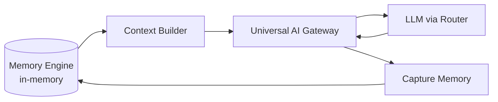

# OSA Context — Architecture

> **Status:** Runtime — Memory Injection v1  
> **Audience:** Engineering  
> **Scope:** Как операционная память попадает в Gateway и обратно  
> **Implementation:** `lib/memory/context-builder.ts`, `lib/memory/gateway-memory.ts`  
> **Related:** [OSA_MEMORY.md](./OSA_MEMORY.md) · [OSA_BRAIN.md](./OSA_BRAIN.md) · [UNIVERSAL_AI_GATEWAY.md](./UNIVERSAL_AI_GATEWAY.md)

---

## 1. Зачем Context Injection

OSA не должна начинать работу с нуля после первого результата.

Memory Engine хранит **операционные записи** (задача, результат, intent, проект). Context Builder превращает их в **краткий контекст** для LLM — не chat history.

---

## 2. Поток



```text
Memory
  ↓ findMemory / getRecentMemory
Context Builder
  ↓ buildGatewayMemoryContext()
Gateway
  ↓ + system message "Context …"
LLM
  ↓ response
Capture Memory
  ↓ captureGatewayMemory()
Memory
```

---

## 3. Перед запросом

`applyGatewayMemoryInjection(request)`:

1. `findMemory()` / `getRecentMemory()` по `organizationId` + `userId`
2. Если есть `scope.projectId` — только память проекта
3. Если `projectId` нет — последние записи пользователя в организации
4. `buildGatewayMemoryContext()` → до **1400** символов
5. Если память пуста — **request не меняется**

Добавляется одно **system** сообщение:

```text
Context

Current Project:
...

Recent Progress:
• ...

Known Goals:
• ...

Current objective

...

Continue from previous work.
```

Без provider names, model names, технического мусора.

---

## 4. После успешного ответа

`captureGatewayMemoryFromResponse(request, response)`:

| Поле | Источник |
| ---- | -------- |
| `task` | Последнее user-сообщение |
| `result` | `response.content` |
| `intent` | `request.routing.intent` |
| `routingCategory` | `request.routing.taskCategory` |
| `projectId` | `request.scope.projectId` |
| `runId` / `correlationId` | `request.trace` |
| `summary` | Авто из task + result |
| `occurredAt` | Timestamp capture |

Ошибки capture **не блокируют** Gateway response.

---

## 5. Модули

| Модуль | Функции |
| ------ | ------- |
| `context-builder.ts` | `buildGatewayMemoryContext`, `buildProjectContext`, `buildRecentContext` |
| `gateway-memory.ts` | `applyGatewayMemoryInjection`, `captureGatewayMemoryFromResponse` |
| `memory-engine.ts` | `captureGatewayMemory`, `findMemory`, `getRecentMemory` (без изменений) |

Точка подключения: `services/runtime/gateway/ai-gateway.ts` — `complete()` и `stream()`.

---

## 6. Что не является контекстом

- История чата message-by-message
- Имена моделей и провайдеров
- Raw tool logs
- Credentials

---

## 7. Эволюция

| Фаза | Изменение |
| ---- | --------- |
| v1 | In-memory, system message injection |
| v2 | Context Builder → Prompt Compiler (unified) |
| v3 | Персистенция Memory в Supabase |
| v4 | Navigator читает тот же store |

---

## 8. Использование документа

- Новый Gateway entry point → вызывать через `aiGateway.complete`, не обходить injection
- Новый scope поля → расширить `GatewayMemoryContextInput`
- Спор chat vs context → только summary bullets, не transcript
