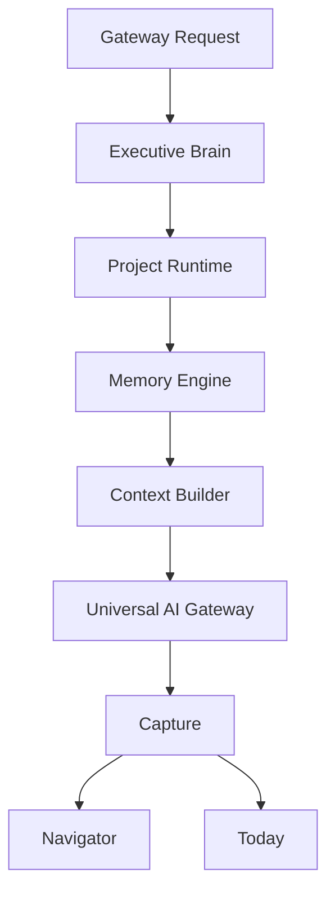

# OSA Executive Brain — Architecture

> **Status:** Runtime v4 — Executive Brain foundation  
> **Audience:** Engineering  
> **Scope:** Единый слой принятия решений до обращения к модели  
> **Implementation:** `lib/executive/`, `types/executive.ts`  
> **Related:** [OSA_PROJECT_RUNTIME.md](./OSA_PROJECT_RUNTIME.md) · [OSA_CONTEXT.md](./OSA_CONTEXT.md) · [OSA_BRAIN.md](./OSA_BRAIN.md)

---

## 1. Зачем Executive Brain

Executive Brain — **не Router** и **не Gateway**.

Он отвечает на вопрос: **что должно произойти до вызова модели?**

- какая цель у пользователя
- продолжение или новая задача
- какой проект использовать
- какую память подключить
- что предложить в Navigator после ответа

`reasoning` в `ExecutiveDecision` — только внутреннее поле. Никогда не показывается пользователю.

---

## 2. Поток



```text
Request
  ↓ applyExecutiveBrain
Executive Brain → ExecutiveDecision
  ↓ setActiveProject / createProjectRuntime
Project Runtime
  ↓ memoryMode
Memory
  ↓ buildGatewayMemoryContext
Context Builder
  ↓ complete / stream
Gateway
  ↓ captureGatewayMemoryFromResponse
Capture
  ↓ navigatorMode
Navigator + Today
```

**Точка входа:** `services/runtime/gateway/ai-gateway.ts` — `applyExecutiveBrain` вызывается **перед** `applyGatewayMemoryInjection`.

Router и Policy не изменяются.

---

## 3. ExecutiveDecision

| Field | Назначение |
| ----- | ---------- |
| `goal` | find_clients · create_content · business_analysis · design · learning · other |
| `workingMode` | continuation · new_task |
| `projectDecision` | continue_active · create_new · default_workspace |
| `projectId` | Runtime id активного проекта или `null` |
| `memoryMode` | none · project · recent · organization |
| `navigatorMode` | next_step · scale · new_project · none |
| `summary` | Краткое описание решения (runtime) |
| `reasoning` | Внутренняя диагностика — **не для UI** |
| `confidence` | 0–1 |

---

## 4. Модули

| Module | Role |
| ------ | ---- |
| `executive-engine.ts` | `applyExecutiveBrain`, `evaluateExecutiveDecision` |
| `executive-context.ts` | Сбор контекста из GatewayRequest |
| `executive-goals.ts` | Детекция цели по тексту задачи |
| `executive-next-action.ts` | Working mode, project, memory, navigator |
| `executive-summary.ts` | Пользовательское summary решения |
| `executive-state.ts` | In-memory store последнего решения по scope |

---

## 5. Решения Executive Brain

### Current Goal

Паттерны в `executive-goals.ts` — детерминированная классификация без LLM.

### Working Mode

- `continuation` — «продолжить», активный проект с `lastActivity`
- `new_task` — новая формулировка без сигналов продолжения

### Project Decision

- `continue_active` — активный проект или `scope.projectId`
- `create_new` — «новый проект», стратегические цели без среды
- `default_workspace` — обучение, пустой контекст

### Memory Decision

| Mode | Когда |
| ---- | ----- |
| `none` | обучение без истории, чистый старт |
| `project` | активный проект с памятью |
| `recent` | продолжение с недавней историей |
| `organization` | анализ бизнеса, org-wide контекст |

### Navigator Decision

Сохраняется в `executive-state` и читается `getNextBestStepContent()` для приоритизации карточек (без изменения UI-компонентов).

---

## 6. Интеграция с Gateway

```typescript
const { request: executiveRequest, decision } = applyExecutiveBrain(request);
const requestWithMemory = applyGatewayMemoryInjection(executiveRequest, decision);
// ...
captureGatewayMemoryFromResponse(requestWithMemory, response, decision);
```

`applyGatewayMemoryInjection` уважает `decision.memoryMode === 'none'` и передаёт `memoryMode` в Context Builder.

---

## 7. Ограничения v4

- In-memory state — без персистентности в DB
- Детерминированные правила — без отдельного LLM-вызова
- UI, Login, Brand, Router, Policy, Navigator UI — не изменяются

---

## 8. Тесты

`tests/executive/executive-brain.test.ts` — unit-тесты целей, режимов, pipeline-интеграции.

Существующие gateway/memory/project-runtime тесты должны проходить без регрессий.
