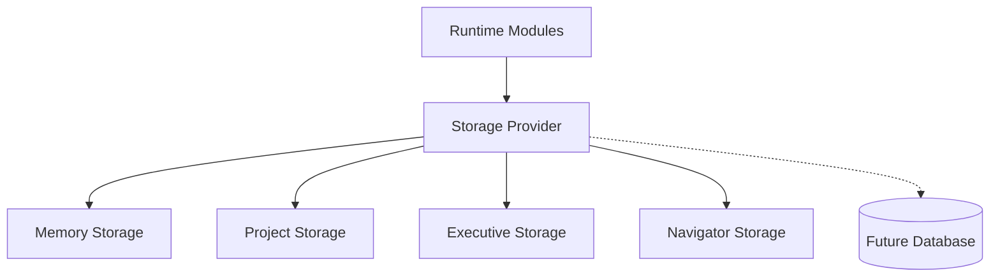

# OSA Persistence Layer — Architecture

> **Status:** Runtime v5 — Persistence foundation  
> **Audience:** Engineering  
> **Scope:** Единый слой хранения для Memory, Projects, Executive, Navigator  
> **Implementation:** `lib/storage/`  
> **Related:** [OSA_MEMORY.md](./OSA_MEMORY.md) · [OSA_PROJECT_RUNTIME.md](./OSA_PROJECT_RUNTIME.md) · [OSA_EXECUTIVE_BRAIN.md](./OSA_EXECUTIVE_BRAIN.md)

---

## 1. Зачем Persistence Layer

До v5 Runtime хранил состояние в прямых `Map`. После рестарта процесса терялись:

- проекты и active project
- operational memory
- executive decisions
- navigator state

Persistence Layer вводит единый контракт `RuntimeStorage` и domain-фасады. Runtime-модули не работают с `Map` напрямую.

---

## 2. Поток



```text
Runtime (Memory Engine, Project Runtime, Executive, Navigator)
  ↓ domain facades (memory-storage, project-storage, …)
RuntimeStorage interface
  ↓ storage-factory
Storage Provider
  ├── MemoryStorage (full — file-backed in non-test Node)
  ├── SupabaseStorage (stub — no DB writes)
  └── LocalStorage (browser stub)
```

---

## 3. RuntimeStorage

| Method | Назначение |
| ------ | ---------- |
| `load` | Прочитать запись по namespace + id |
| `save` | Сохранить запись |
| `update` | Атомарное обновление через updater |
| `delete` | Удалить запись |
| `list` | Список записей namespace |
| `listIds` | Список id |
| `exists` | Проверка наличия |
| `clear` | Очистить namespace |
| `clearAll` | Очистить все namespaces |

---

## 4. Namespaces

| Namespace | Domain |
| --------- | ------ |
| `memory:entries` | MemoryEntry |
| `memory:projects` | MemoryProject |
| `project:runtimes` | ProjectRuntime |
| `project:active` | Active project id per scope |
| `executive:decisions` | ExecutiveDecision |
| `navigator:state` | NavigatorPersistedState |

---

## 5. Provider selection

`storage-factory.ts` выбирает provider:

| Condition | Provider |
| --------- | -------- |
| `RUNTIME_STORAGE_PROVIDER=supabase` | SupabaseStorage (stub) |
| `RUNTIME_STORAGE_PROVIDER=local` or browser | LocalStorage |
| default server | MemoryStorage |

Persistence to disk (Node, non-test):

- `RUNTIME_STORAGE_PERSIST=true` or `NODE_ENV !== test`
- File: `.data/runtime-storage.json`

Tests use isolated non-persistent MemoryStorage via `resetRuntimeStorage()`.

---

## 6. Module mapping

| Runtime module | Storage facade | Public API |
| -------------- | -------------- | ---------- |
| `memory-store.ts` | `memory-storage.ts` | unchanged |
| `project-runtime-store.ts` | `project-storage.ts` | unchanged |
| `executive-state.ts` | `executive-storage.ts` | unchanged |
| Navigator runtime | `navigator-storage.ts` | via `getNextBestStepContent` |

Gateway продолжает вызывать те же Runtime API — изменений в Gateway API нет.

---

## 7. Future Database

`SupabaseStorageProvider` — заглушка без изменения существующей схемы БД.

Следующий этап:

1. Таблицы `runtime_memory`, `runtime_projects`, `runtime_executive`, `runtime_navigator`
2. Реализация `SupabaseStorageProvider.load/save/...`
3. `RUNTIME_STORAGE_PROVIDER=supabase` в production

---

## 8. Тесты

`tests/storage/runtime-storage.test.ts` — контракт RuntimeStorage, persistence round-trip, factory selection.

Все существующие runtime/gateway тесты должны проходить без изменения публичных API.
