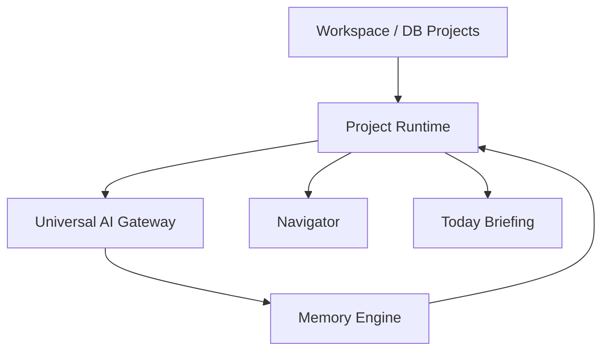

# OSA Project Runtime — Architecture

> **Status:** Runtime v3 — Projects Brain foundation  
> **Audience:** Engineering  
> **Scope:** Проект как полноценное рабочее пространство, не папка и не chat history  
> **Implementation:** `lib/project-runtime/`, `types/project-runtime.ts`  
> **Related:** [OSA_MEMORY.md](./OSA_MEMORY.md) · [OSA_CONTEXT.md](./OSA_CONTEXT.md) · [OSA_BRAIN.md](./OSA_BRAIN.md)

---

## 1. Зачем Project Runtime

OSA должна понимать, **в каком проекте** сейчас работает пользователь.

Проект — это:

- собственная память
- собственные задачи и результаты
- собственный контекст для Gateway
- собственная история решений
- собственное состояние Navigator

Не chat history. Не файловая папка. **Рабочая среда.**

---

## 2. Поток



```text
Workspace (snapshot projects)
  ↓ syncProjectRuntimesFromSnapshot
Project Runtime
  ↓ resolveActiveProject / setActiveProject
Gateway
  ↓ buildGatewayMemoryContext + captureGatewayMemory
Memory
  ↓ project-scoped entries
Navigator
  ↓ buildNavigatorStepsForProject
Today
  ↓ buildProjectTodayBriefing
```

---

## 3. ProjectRuntime entity

| Field | Назначение |
| ----- | ---------- |
| `id` | Runtime id (DB id или default-workspace) |
| `title` | Название проекта |
| `description` | Краткое описание среды |
| `status` | planning / active / paused / completed |
| `active` | Флаг активного проекта в scope |
| `summary` | Текущее summary проекта |
| `mission` | Миссия / цель проекта |
| `lastActivity` | Последняя активность |
| `nextStep` | Следующий шаг |
| `memorySummary` | Summary из Memory Engine |
| `navigatorState` | Состояние Navigator |
| `sourceProjectId` | Связь с DB project |

---

## 4. Active Project

| API | Назначение |
| --- | ---------- |
| `setActiveProject(scope, id)` | Переключить активный проект |
| `getActiveProject(scope)` | Получить активный или `null` |
| `resolveActiveProject(scope)` | Активный, последний проект или Default Workspace |
| `resolveGatewayProjectId(scope)` | `projectId` для Gateway scope |

**Default Workspace** используется, когда проект не выбран и нет синхронизированных проектов.

---

## 5. Gateway integration

Перед каждым `aiGateway.complete()`:

1. `resolveActiveProject(scope)`
2. `buildGatewayMemoryContext({ projectRuntime, projectId })`
3. System message: Current Project, Mission, Summary, Recent Decisions, Next Step
4. Без chat history

После успешного ответа:

1. `captureGatewayMemory({ projectId })`
2. `recordProjectRuntimeFromGateway()`
3. `syncProjectMemoryState()`

---

## 6. Memory scoping

Память автоматически прикрепляется к `active project`.

При смене проекта новые записи создаются в scope нового `projectId`.

Старые записи остаются в памяти исходного проекта.

---

## 7. Navigator

`buildNavigatorStepsForProject(runtime)` строит карточки:

- Быстро получить результат
- Построить систему
- Масштабировать

относительно **текущего проекта**.

`resolveNextBestStepContent(scope)` — runtime entry point.

---

## 8. Today

`buildProjectTodayBriefing(runtime, snapshot)` возвращает:

- headline: «Сегодня вы работаете над: …»
- lastResult
- nextStep
- progressPercent

Данные попадают в `ConciergeData` через mappers — без изменения UI-компонентов.

---

## 9. Модули

| Path | Role |
| ---- | ---- |
| `project-runtime-engine.ts` | CRUD, progress |
| `project-runtime-store.ts` | In-memory store |
| `active-project.ts` | Active project resolution |
| `project-runtime-memory.ts` | Memory sync + gateway record |
| `project-runtime-sync.ts` | Sync from cabinet snapshot |
| `navigator-steps.ts` | Navigator cards |
| `today-briefing.ts` | Today data |
| `scope.ts` | org/user scope from snapshot |

---

## 10. Эволюция

| Phase | Change |
| ----- | ------ |
| v3 | In-memory Project Runtime |
| v4 | Persist active project per user in DB |
| v5 | Project switcher writes `setActiveProject` from UI |

---

## 11. Использование

- Новый Gateway entry → active project auto-resolved
- Новый DB project → `syncProjectRuntimesFromSnapshot`
- Navigator / Today → read via `resolveActiveProject`, not mocks
