<!-- markdownlint-disable MD013 MD060 MD036 MD024 -->

# AI Business OS — Internal Reasoning Architecture v1.0

**Status:** Product architecture (no implementation in this document)  
**Date:** 2026-06-28  
**Scope:** Everything that happens **after the user presses Start** on Intent Confirmation  
**Audience:** Product, engineering, design leadership

**Related:** [AI Runtime](./AI_RUNTIME.md) · [Observability](./OBSERVABILITY.md) · [Customer Journey](../business/CUSTOMER_JOURNEY.md) · [Decision Log](../product/DECISION_LOG.md)

---

## Executive summary

When the user presses **Start**, AI Business OS enters a **closed reasoning loop**: understand → plan → delegate → synthesize → verify → remember → recommend.

The user never sees this machinery. They see human progress messages and a **Result**. Internally, the platform behaves like three companies collaborated on the design:

| Influence | What we borrow |
| --------- | -------------- |
| **OpenAI** | Layered reasoning, tool use, specialist prompts, traceable inference |
| **Apple** | Invisible complexity, one clear moment of truth, no configuration surface |
| **Stripe** | Hard sync/async boundaries, idempotent steps, durable state, observable pipelines |

This document defines **what** happens and **why**. It does not prescribe code changes.

---

## Design principles

1. **Understand before act** — No specialist runs until intent is bound (goal, prompt, optional clarification).
2. **Deterministic where possible** — Team selection, plan shape, and confidence rules are explainable without an LLM.
3. **LLM where necessary** — Specialist outputs, synthesis, and nuanced quality checks use models through a single gateway.
4. **Durable by default** — Every meaningful step emits events; the Result is reconstructable from `agent_runs` + `events`.
5. **Fail gracefully** — Low confidence triggers **one** human clarification before Start; failures surface as Results with human copy, not stack traces.
6. **Memory compounds** — Each completed Result updates business context for the next session.

---

## System context (after Start)

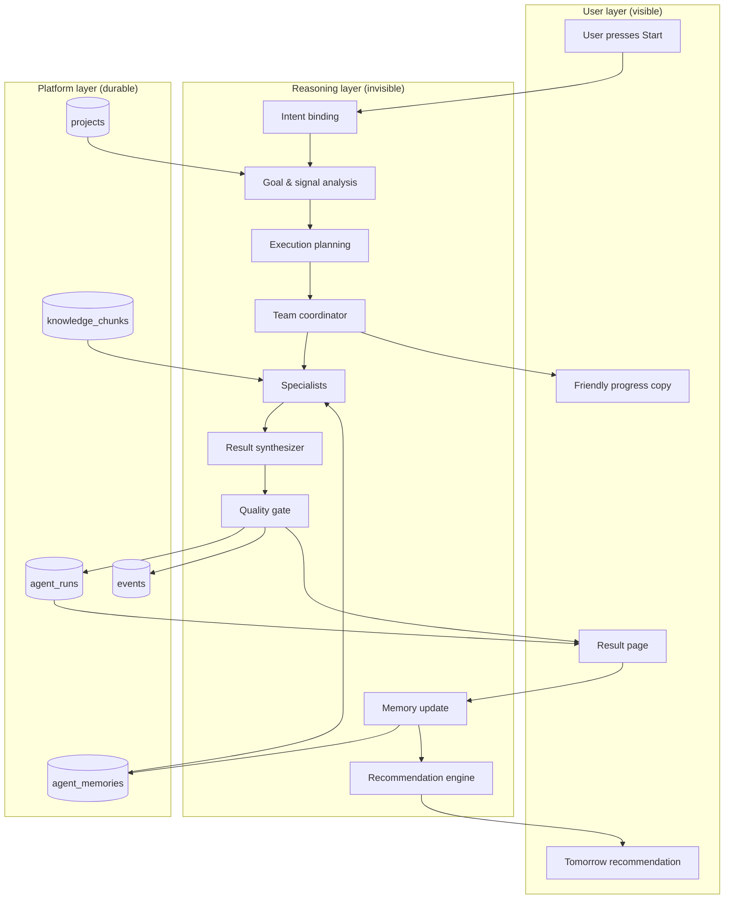

---

## End-to-end sequence (after Start)

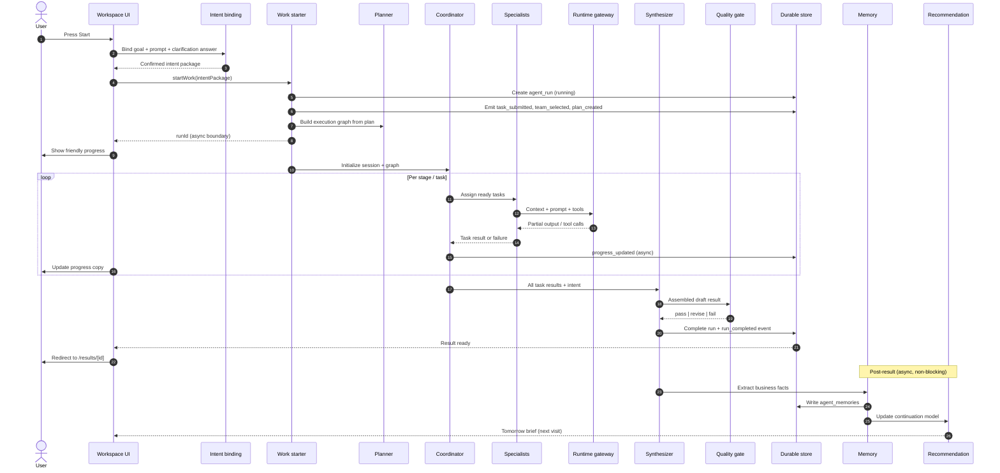

---

## Step-by-step flow

### Phase 0 — Preconditions (already satisfied at Start)

Before Start is enabled, the platform has already:

- Bound a **Home goal** (e.g. Find Clients)
- Run **Wow** and **Intent Confirmation** (or answered **one** clarification)
- Built a **draft team** and **draft plan** (used again after Start, not recomputed from scratch unless prompt changed)

Start means: *"I accept this understanding; proceed."*

---

### Phase 1 — Intent binding (synchronous)

| Step | Action |
| ---- | ------ |
| 1.1 | Freeze intent package: `goalId`, `goalTitle`, `starterPrompt`, clarification suffix (if any), `sessionId`, org + user |
| 1.2 | Mark handoff consumed (user cannot replay the same session) |
| 1.3 | Validate prompt + team non-empty |

**Output:** `IntentPackage` — immutable for this run.

---

### Phase 2 — Work initiation (synchronous, &lt; 2s target)

| Step | Action |
| ---- | ------ |
| 2.1 | Create `agent_runs` row — status `running`, correlation_id = run.id |
| 2.2 | Persist selected specialists and execution plan on run input |
| 2.3 | Build **execution graph** (tasks per stage per specialist) |
| 2.4 | Initialize **coordinator session** — state `running` |
| 2.5 | Emit events: `task_submitted`, `team_selected`, `execution_plan_created`, `runtime_started` |
| 2.6 | Return `runId` to UI |

User sees progress immediately; heavy work has not finished yet.

---

### Phase 3 — Coordinated execution (asynchronous)

| Step | Action |
| ---- | ------ |
| 3.1 | Coordinator loads ready tasks from graph (respects dependencies) |
| 3.2 | For each task: build specialist context (intent, prior task outputs, business description, memory, knowledge) |
| 3.3 | Invoke runtime gateway (LLM + tools) per specialist task |
| 3.4 | On task complete: store result, unlock dependents |
| 3.5 | Emit `progress_updated` events (throttled) |
| 3.6 | Repeat until all tasks complete, fail, or cancel |

---

### Phase 4 — Synthesis (synchronous within run)

| Step | Action |
| ---- | ------ |
| 4.1 | Collect all specialist `ExecutionResult` objects |
| 4.2 | **Synthesizer** produces user-facing deliverable (single narrative + structured sections) |
| 4.3 | Map to Result model: requested, completed, key outcome, artifacts |
| 4.4 | Quality gate (see §8) |
| 4.5 | Mark run `completed` or `failed`; emit terminal event |

---

### Phase 5 — Presentation (synchronous)

| Step | Action |
| ---- | ------ |
| 5.1 | Redirect to `/results/[runId]` |
| 5.2 | Render Result page: celebration (if first), summary, artifacts, What's next |
| 5.3 | User may save to project, continue, or leave |

---

### Phase 6 — Post-result enrichment (asynchronous)

| Step | Action |
| ---- | ------ |
| 6.1 | Memory extraction from result + intent |
| 6.2 | Update recommendation graph for Tomorrow |
| 6.3 | Invalidate dashboard/history caches |

User is never blocked on Phase 6.

---

## 1. How the system understands the user's goal

Understanding is **layered**, not a single LLM call.

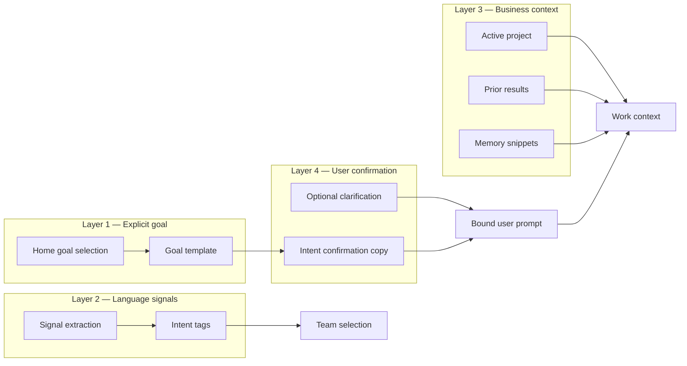

| Layer | Source | Purpose |
| ----- | ------ | ------- |
| **Explicit goal** | User picks Find Clients, Grow Revenue, etc. | Sets JTBD template: what to analyze, what to deliver |
| **Starter prompt** | Goal definition + optional project name | Natural language task description |
| **Signal analysis** | Keyword/pattern rules over normalized prompt | Detects profession, pain, deliverable type, urgency |
| **Business context** | Organization, project, history, memory | Grounds specialists in *this* business |
| **Confirmation** | Intent screen | User verifies understanding before work |
| **Clarification** | One binary choice if confidence low | Disambiguates without interrogation |

**Canonical understanding artifact:** `IntentPackage` stored on the run.

---

## 2. How confidence is calculated

Confidence answers: *"Are we sure enough to start without asking the user another question?"*

Two confidence systems cooperate:

### A. Navigator confidence (specialist routing)

Computed **deterministically** from signal analysis:

| Input | Effect on confidence |
| ----- | -------------------- |
| Top team category score | +0–40 (capped) |
| Gap between 1st and 2nd category | +0–20 (clear winner → higher) |
| Number of matched intent tags | +0–16 |
| No tags matched | −12 |
| No category scored | Floor ≈ 35 |

**Range:** 0–100 (internal only — **never shown to user**).

`needsNavigatorReview = confidence < 55`

### B. Intent confidence (user-facing gate)

| Rule | Outcome |
| ---- | ------- |
| Goal is `dont_know` | Always ask **one** clarification before confirmation |
| Navigator `needsNavigatorReview` | Ask goal-specific clarification (max 2 options) |
| User answered clarification | Skip further questions; append choice to prompt |
| Otherwise | Go straight to Intent Confirmation → Start |

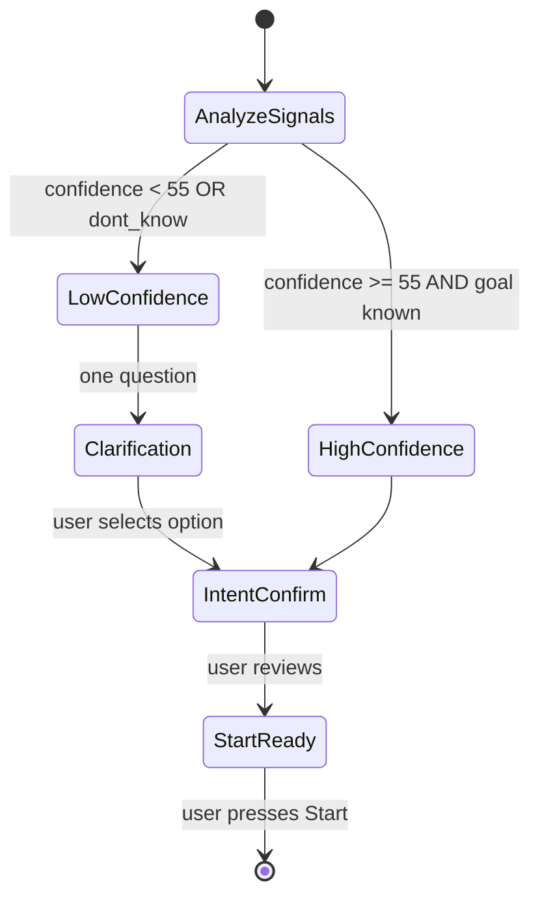

---

## 3. When clarification questions are asked

**Hard rules:**

| Rule | Detail |
| ---- | ------ |
| **Maximum one question** | Never a chain of clarifications |
| **Maximum two options** | Binary choice only |
| **Before Start** | Never during execution |
| **Goal-specific copy** | Human language; no technical terms |
| **Never show confidence %** | User sees a question, not a score |

**Examples:**

| Goal | Question shape |
| ---- | -------------- |
| Find Clients | new customers **or** business partners |
| Increase Revenue | existing customers **or** new customers |
| Don't Know | growth focus **or** organization focus |

If clarification is skipped (high confidence), the prompt still contains goal template context.

---

## 4. How the system decides which specialists participate

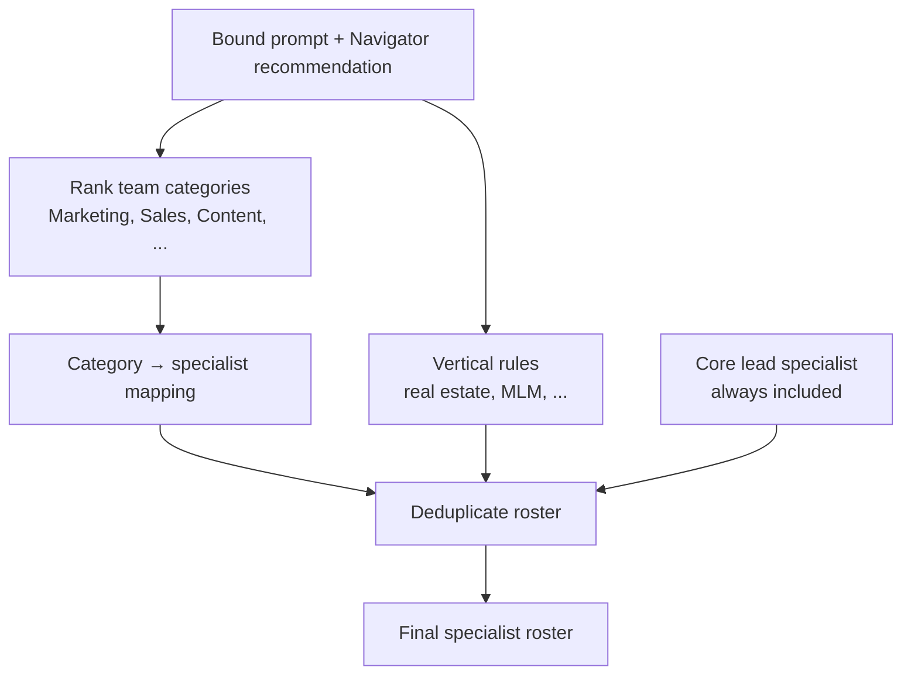

| Stage | Logic |
| ----- | ----- |
| **Category ranking** | Navigator scores 9 business categories from signals + keywords |
| **Primary team** | Top-scoring category (ties allowed) |
| **Secondary team** | Categories within 10 points of second place |
| **Agent mapping** | Each category maps to 1–2 specialist roles (e.g. Sales → CRM) |
| **Vertical boost** | Pattern rules add estate, MLM, etc. when detected |
| **Core inclusion** | Business lead specialist always on team |
| **Execution plan** | Planner assigns specialists to stages: Discovery → Execution → Review |

Specialists are **roles**, not user-visible employees. The user sees progress copy, not names like "CRM Agent."

---

## 5. How specialists communicate

Specialists do **not** chat with each other. They communicate through **structured coordination**:

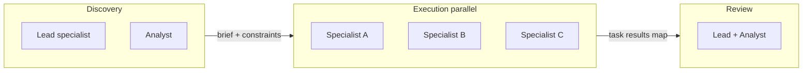

| Mechanism | Description |
| --------- | ----------- |
| **Execution graph** | DAG of tasks with explicit `dependsOn` |
| **Shared session** | Coordinator holds `results[taskId]` |
| **Context injection** | Each task prompt includes: intent, business description, upstream summaries |
| **No peer messaging** | Avoids runaway multi-agent conversations |
| **Events** | `progress_updated` snapshots graph state for observability |
| **Knowledge & memory** | Read-only inputs per task via context builder |

**Apple principle:** One conductor (coordinator), many musicians (specialists), sheet music (plan + graph).

---

## 6. How disagreements are resolved

Disagreement can occur when parallel specialists produce conflicting recommendations.

**Resolution hierarchy (in order):**

| Priority | Resolver | Behavior |
| -------- | -------- | -------- |
| 1 | **Plan precedence** | Review stage always runs last; synthesis sees all outputs |
| 2 | **Lead specialist** | Business lead consolidates in Review stage |
| 3 | **Goal template** | Deliverable shape defined by goal wins over specialist drift |
| 4 | **User intent** | Bound prompt is tie-breaker |
| 5 | **Conservative merge** | If unresolvable, surface uncertainty in Result honestly |

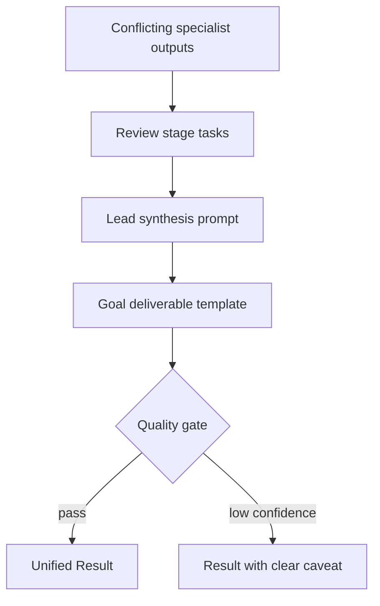

**Never** show "Agent A disagrees with Agent B" to the user. The Result is one voice.

---

## 7. How the final result is assembled

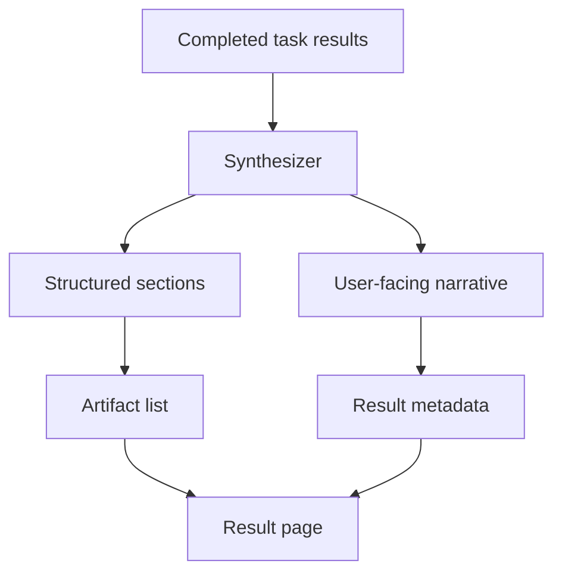

| Output field | Source |
| ------------ | ------ |
| **Title** | User prompt or goal title |
| **What was requested** | Bound prompt + goal template |
| **What was completed** | Synthesizer narrative from specialist outputs |
| **Key outcome** | First actionable sentence or summary |
| **Artifacts** | Detected deliverables (plan, analysis, draft content) |
| **Timeline** | Human milestones from events (Requested → Started → Working → Completed) |
| **What's next** | Recommendation engine (§10) |

The Result is a **product object** (`/results/[id]`), not a raw run dump.

---

## 8. How quality is verified

Quality gate runs **before** the user sees the Result.

| Check | Type | Fail behavior |
| ----- | ---- | ------------- |
| Prompt / goal alignment | Rule + LLM | Revise once or fail run |
| Non-empty deliverable | Rule | Fail with human message |
| Minimum structure (sections present) | Rule | Revise |
| Safety / policy | Rule + gateway | Fail |
| Hallucination guard (no fabricated specifics) | LLM | Soften or flag uncertainty |
| Language | Rule | User locale consistency |

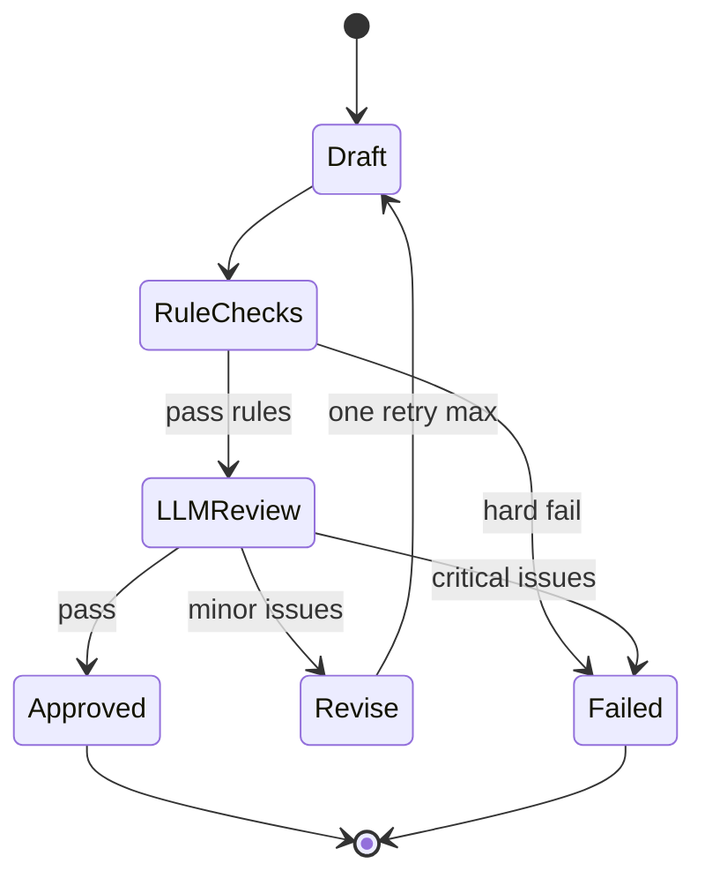

**Stripe principle:** Terminal states are explicit (`completed` | `failed`); partial success is not silently shipped.

---

## 9. How memory is updated

Memory updates happen **after** Result approval, **asynchronously**.

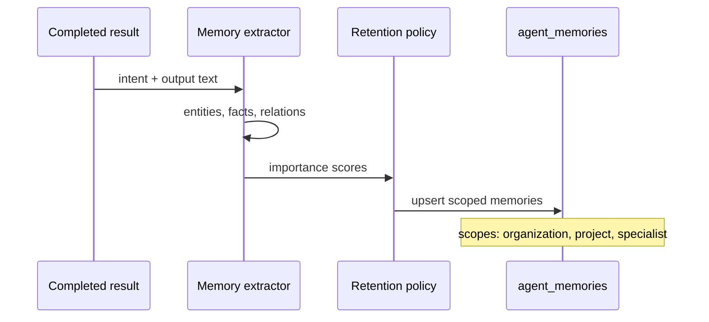

| Memory type | Examples | Used when |
| ----------- | -------- | --------- |
| **Business facts** | Industry, offer, target customer | Next goal understanding |
| **Preferences** | Tone, channels, constraints | Specialist prompts |
| **Outcomes** | "Last time we built acquisition plan" | Personal welcome, continue |
| **Entities** | Project names, markets | Context injection |

**Rules:**

- Never block Result delivery on memory write
- Org-scoped RLS on all memories
- Low-importance facts decay or merge over time
- User-visible surfaces never say "memory" — they feel **remembered**

---

## 10. How recommendations for tomorrow are generated

Recommendations power **Personal Welcome**, **Continue Journey**, and **What's next** on Results.

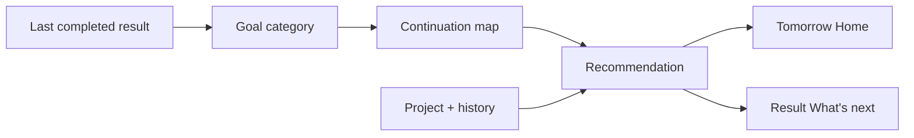

| Surface | Recommendation logic |
| ------- | -------------------- |
| **Personal welcome** | "Yesterday we finished X" + "Today continue Y" |
| **Continue journey** | In-progress work or last project |
| **Result What's next** | Save to project **or** next logical goal |
| **Intent confirmation** | Deliverable list from goal template |

Continuation map example (internal): after Content goal → suggest Client Acquisition.

Recommendations are **deterministic rules first**, LLM personalization later. One clear suggestion beats five weak ones.

---

## 11. How business context changes future decisions

| Context signal | Future effect |
| -------------- | ------------- |
| **Project attached** | Prompts include project name; results link to project |
| **Completed results history** | Personal welcome, faster TTFV (skip re-explaining) |
| **Memory facts** | Specialist context injection; better signal confidence |
| **Knowledge base** | Retrieval augments specialists in execution phase |
| **Clarification answers** | Permanently shapes prompt suffix for session |
| **Failed results** | Lower automatic confidence; more conservative plans |
| **Vertical patterns** | Specialist roster bias (estate, MLM) |

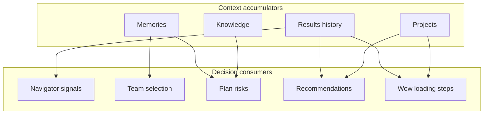

**Compounding loop:** Each successful Result makes the next session faster, more personal, and more accurate — without asking the user to reconfigure anything.

---

## 12. Synchronous vs asynchronous boundaries

| Step | Mode | Target latency | User waits? | Durable write? |
| ---- | ---- | -------------- | ----------- | -------------- |
| Intent binding | **Sync** | &lt; 100ms | Yes | Handoff consumed |
| Create run + graph | **Sync** | &lt; 2s | Yes (progress UI) | Yes |
| Specialist execution | **Async** | 30s – 3min | Yes (progress copy) | Progress events |
| Progress polling | **Async** | 1–2s interval | Background | Optional read |
| Synthesis + quality | **Sync** | &lt; 30s | Yes | Yes |
| Redirect to Result | **Sync** | &lt; 500ms | Yes | — |
| Memory extraction | **Async** | Seconds | No | Yes |
| Recommendation refresh | **Async** | Seconds | No | Cache |
| Dashboard/history revalidate | **Async** | Best effort | No | — |

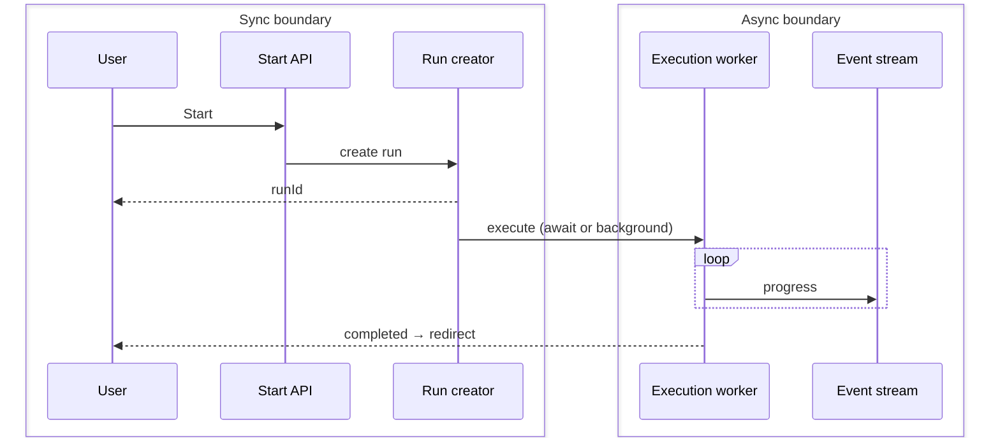

**Stripe rule:** The sync boundary ends when the user has a **durable run ID** and truthful progress feedback. Everything heavier runs behind that contract.

---

## Coordinator state machine

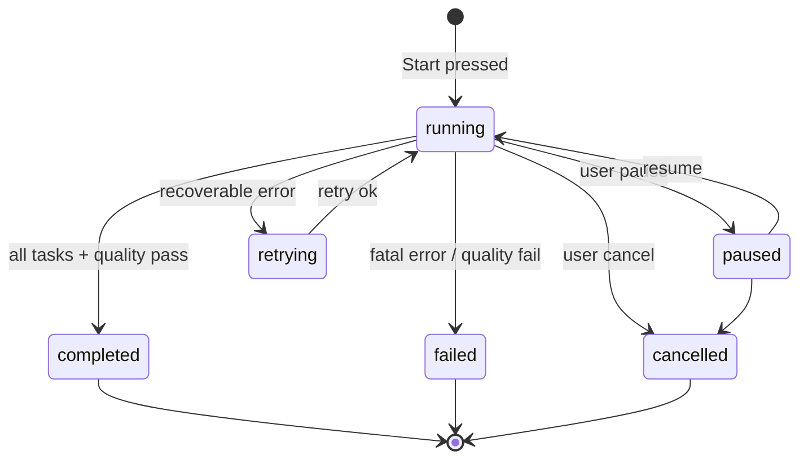

---

## Result lifecycle (user-visible)

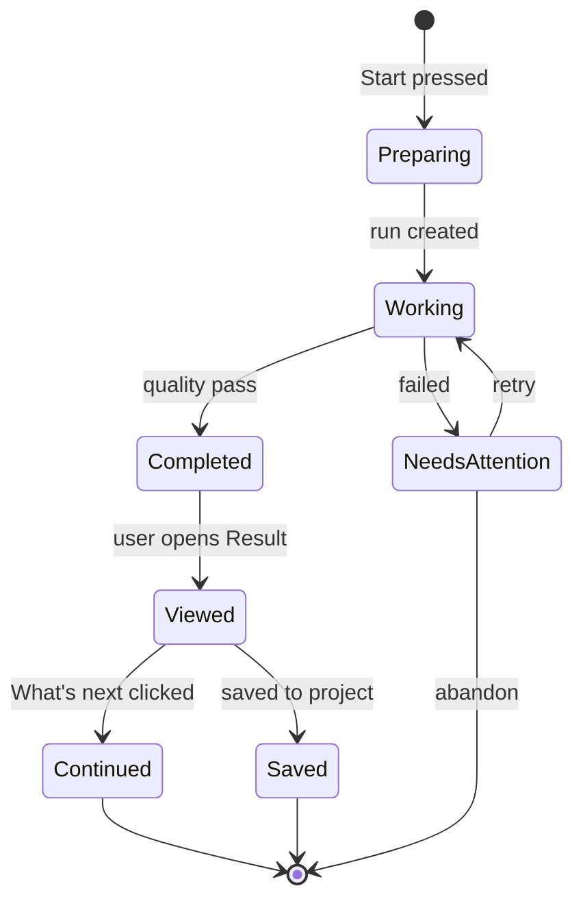

---

## Layered architecture (OpenAI-style)

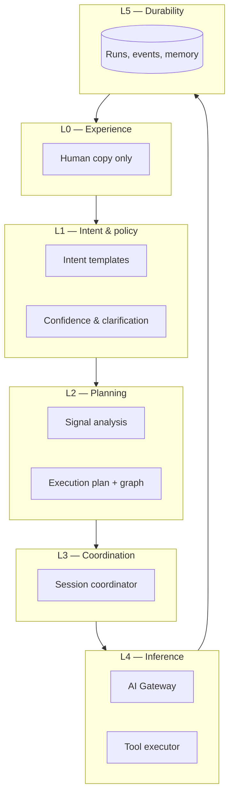

---

## Observability contract

Every phase emits events keyed by `correlation_id = run.id`:

| Event | Phase |
| ----- | ----- |
| `task_submitted` | Start |
| `team_selected` | Start |
| `execution_plan_created` | Start |
| `runtime_started` | Execution |
| `progress_updated` | Execution |
| `run_completed` / `run_failed` | Terminal |

Internal operators see the timeline; users see the Result timeline in human language.

---

## Glossary (internal)

| Term | Meaning |
| ---- | ------- |
| **Intent package** | Frozen user goal + prompt at Start |
| **Navigator** | Deterministic signal + category scoring engine |
| **Specialist** | Role-bound inference unit (not user-visible) |
| **Coordinator** | Conductor of task graph execution |
| **Synthesizer** | Merges specialist outputs into one Result |
| **Result** | User-facing completed work object |

---

## Open architecture decisions

| ID | Question | Options |
| -- | -------- | ------- |
| RA-001 | Execute await vs background job | Current: await in server action; future: queue worker |
| RA-002 | LLM-based vs rule-based synthesis | Hybrid: rules for structure, LLM for prose |
| RA-003 | Memory write policy | Auto vs user-approved facts |
| RA-004 | Quality gate strictness at MVP | Hard fail vs ship with caveat |

---

## Success criteria for this architecture

1. User presses Start → receives a **usable Result** without further questions.
2. Confidence and clarification never expose internal scores.
3. Specialist coordination is **traceable** but **invisible**.
4. Tomorrow's Home feels more personal than today's without new user input.
5. Sync/async boundaries prevent hung UI and duplicate runs.

---

*Architecture only. Implementation must preserve invisible-AI UX per [Decision Log](../product/DECISION_LOG.md).*
