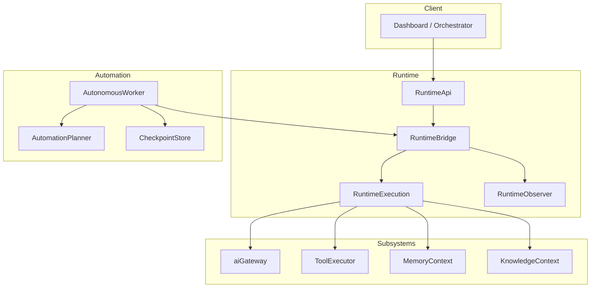
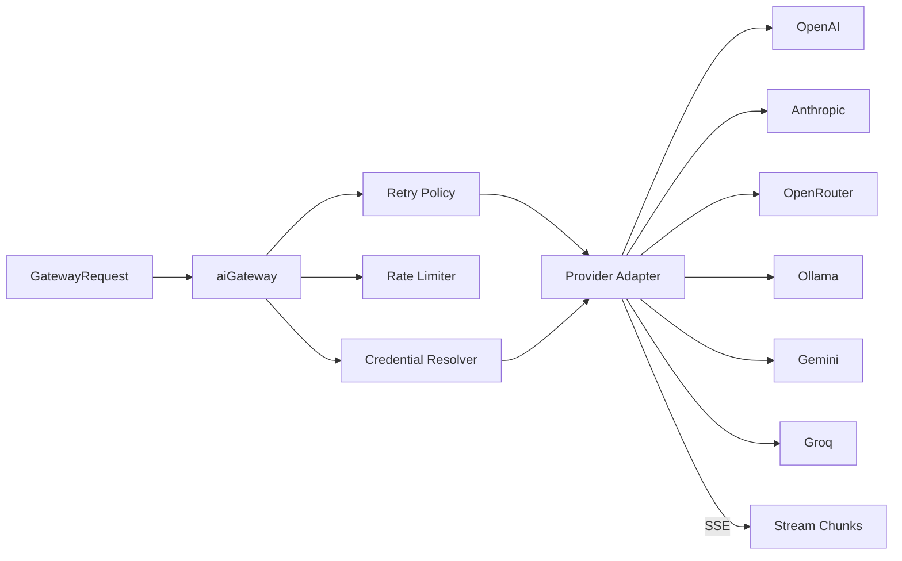
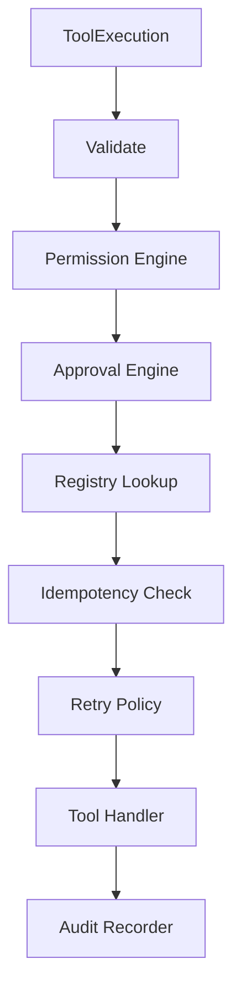

# Architecture Diagrams

## Production Execution Stack

```mermaid
flowchart TB
  subgraph Client
    UI[Dashboard / Orchestrator]
  end

  subgraph Runtime
    API[RuntimeApi]
    Bridge[RuntimeBridge]
    Exec[RuntimeExecution]
    Obs[RuntimeObserver]
  end

  subgraph Subsystems
    GW[aiGateway]
    Tools[ToolExecutor]
    Mem[MemoryContext]
    Know[KnowledgeContext]
  end

  subgraph Automation
    Planner[AutomationPlanner]
    Worker[AutonomousWorker]
    CKPT[CheckpointStore]
  end

  UI --> API --> Bridge --> Exec
  Bridge --> Obs
  Exec --> GW
  Exec --> Tools
  Exec --> Mem
  Exec --> Know
  Worker --> Planner
  Worker --> CKPT
  Worker --> Bridge
```

## Gateway Provider Layer

```mermaid
flowchart LR
  Request[GatewayRequest] --> GW[aiGateway]
  GW --> Retry[Retry Policy]
  GW --> RL[Rate Limiter]
  GW --> CR[Credential Resolver]
  Retry --> Adapter[Provider Adapter]
  CR --> Adapter
  Adapter --> OpenAI
  Adapter --> Anthropic
  Adapter --> OpenRouter
  Adapter --> Ollama
  Adapter --> Gemini
  Adapter --> Groq
  Adapter -->|SSE| Stream[Stream Chunks]
```

## Tool Execution Pipeline

```mermaid
flowchart TD
  Req[ToolExecution] --> Val[Validate]
  Val --> Perm[Permission Engine]
  Perm --> Appr[Approval Engine]
  Appr --> Reg[Registry Lookup]
  Reg --> Idem[Idempotency Check]
  Idem --> Retry[Retry Policy]
  Retry --> Handler[Tool Handler]
  Handler --> Audit[Audit Recorder]
```
