<!-- markdownlint-disable MD013 MD060 MD036 MD024 -->

# AI Business OS — User Value Engine v1.0

**Status:** Product design (not technical)  
**Date:** 2026-06-28  
**Question this document answers:** *Why does a customer keep paying every month?*

**Related:** [Product Manifesto](./PRODUCT_MANIFESTO.md) · [Customer Journey](../business/CUSTOMER_JOURNEY.md) · [Retention Model](../business/RETENTION_MODEL.md) · [Business Model](../business/BUSINESS_MODEL.md) · [Pricing Strategy](../business/PRICING_STRATEGY.md)

---

## Executive summary

AI Business OS is not sold on intelligence. It is sold on **finished business progress** — the feeling that work got done, decisions got clearer, and tomorrow already has a plan.

Customers renew when the platform becomes the place where their business **remembers**, **decides**, and **delivers** faster than any alternative. The value engine has five gears:

```text
First outcome  →  Daily return  →  Weekly rhythm  →  Monthly proof  →  Yearly dependency
```

Each gear compounds the next. Miss the first outcome and nothing else matters. Nail the first ten minutes and the rest of the engine has fuel.

---

## 1. The first 10 minutes

### What value a new user receives

In the first session, the user does not learn software. They **receive work**.

| Minute | What happens | Value delivered |
| ------ | ------------ | --------------- |
| 0–1 | Opens Home; sees Today briefing | "This is about my business, not a dashboard" |
| 1–2 | Picks a goal in plain language | "I don't need to explain my whole company" |
| 2–4 | Sees preparation that reflects their situation | "It already understands what I'm trying to do" |
| 4–5 | Confirms intent before work starts | "Nothing runs until I agree — I'm in control" |
| 5–10 | Receives a completed Result | "I have something I can use today" |

The first session ends with **one tangible deliverable**: a plan, analysis, draft, or next-step framework — not a chat transcript.

### What creates the Wow

The Wow is not animation. The Wow is **recognition plus delivery**.

| Wow ingredient | User feeling |
| -------------- | ------------ |
| **Personal greeting** | "It knows it's me and what day it is" |
| **Goal in my words** | "I didn't have to configure anything" |
| **Preparation that mirrors my business** | "It thought about this before I pressed Start" |
| **Intent confirmation** | "It got my request right — I would have written it the same way" |
| **Speed to finished work** | "That would have taken me hours alone" |
| **Professional celebration of first result** | "This is serious software, not a toy" |

The Wow moment is the intersection of **being understood** and **getting something done**. Either alone is forgettable. Together they are memorable.

### What makes them trust the product

Trust is earned in three beats:

1. **Transparency before action** — The platform shows what it understood and what it will deliver *before* work begins. No black box.
2. **Competence without arrogance** — The Result reads like a capable colleague prepared it: structured, actionable, honest about limits.
3. **Continuity promise** — The Result ends with a clear "What's next" and an offer to save to a project. The user senses this work will not vanish.

Trust is damaged by: jargon, empty dashboards, generic advice, or work that starts before the user agrees.

### What makes them continue

The first session succeeds when the user leaves with:

- A Result they can **use** (send, implement, or share)
- A **next step** they believe in
- A reason to **return tomorrow** (unfinished thread, saved project, or recommended continuation)

The continue trigger is not "come back and explore." It is: **"You have momentum — pick it up in one tap."**

---

## 2. The first week

### The daily experience

Each morning, the user opens **Today** — not a task list, but a briefing:

- What matters now
- Where they left off
- One recommended priority

The daily loop is intentionally short:

```text
Open Today  →  See continuity  →  Choose goal or Continue  →  Get Result  →  Know tomorrow's step
```

No daily homework. No empty states. The platform meets the user where their business actually is.

### Why they should come back tomorrow

| Reason | What they feel |
| ------ | -------------- |
| **Unfinished momentum** | "I was in the middle of something real" |
| **Yesterday's recommendation** | "It already thought about my next move" |
| **Low re-entry cost** | "One tap — I don't rebuild context" |
| **Fresh business need** | "Something new came up and I know where to go" |

The Tomorrow test: after every session, the user can answer *"What should I do next?"* without opening another app.

### What becomes easier each day

| Day | Easier because… |
| --- | --------------- |
| Day 1 | First Result proves the platform works |
| Day 2 | Continue removes setup; greeting references yesterday |
| Day 3 | History shows a trail of completed work |
| Day 4 | Projects group related Results |
| Day 5 | Recommendations feel less generic |
| Day 6 | User stops explaining basics — context carries forward |
| Day 7 | Platform feels like a habit, not an experiment |

### What compounds

- **Completed Results** — evidence of progress, not just activity
- **Project structure** — work organized by initiative, not scattered files
- **Business context** — every session teaches the platform more about the user's market, offer, and priorities
- **Trust in recommendations** — when yesterday's suggestion was right, tomorrow's is easier to accept
- **Time saved** — re-explaining the business shrinks with each visit

By day seven, the user is not evaluating the product. They are **using it to run a piece of their week**.

---

## 3. The first month

### What has changed in their business after 30 days

After a month of regular use, the user's business feels different in concrete ways:

| Area | Before | After 30 days |
| ---- | ------ | ------------- |
| **Planning** | Ideas in head or scattered notes | Written plans and priorities in one place |
| **Client work** | Reactive, ad hoc | Outreach, offers, and follow-ups prepared in advance |
| **Decisions** | Delayed by overload | Framed, compared, and documented |
| **Organization** | Context lost between tools | Projects and history hold the thread |
| **Confidence** | "I should be doing more" | "I know what I'm doing this week" |

The platform does not replace the user's judgment. It **removes the friction between intention and execution**.

### Measurable outcomes

These are the outcomes that justify renewal — observable without opening settings:

| Outcome | Example signal |
| ------- | -------------- |
| **Results completed** | 8–15 finished deliverables in month one |
| **Active projects** | 2–4 initiatives with saved work |
| **Return frequency** | 3+ days per week with at least one session |
| **Time to next step** | Under 2 minutes from open to working |
| **Reuse rate** | User returns to prior Results or continues threads |
| **Business progress narrative** | User can describe what moved forward this month |

North Star alignment: the business belongs to **Weekly Active Businesses with Outcomes** — real work completed, not logins.

### How AI Business OS becomes harder to replace

By day 30, switching means:

- Rebuilding project context elsewhere
- Losing the thread of "what we decided and why"
- Losing personalized recommendations tuned to their goals
- Going back to starting from zero on every new task

The product is no longer "an app they tried." It is **where a month of their operating rhythm lives**.

---

## 4. Six months later

### What information the platform knows

Not as a data warehouse — as a **working understanding** of the business:

| Domain | Examples |
| ------ | -------- |
| **Who they serve** | Target customers, partners, markets |
| **What they sell** | Offers, positioning, pricing context |
| **How they work** | Active projects, priorities, bottlenecks |
| **What they decided** | Plans chosen, directions rejected, constraints stated |
| **What they completed** | Results history by goal type |
| **What works for them** | Accepted recommendations, preferred goal paths |

The user never "manages a profile." They simply work — and the platform accumulates understanding like a long-tenured chief of staff.

### What work has disappeared

| Work that used to happen manually | Now handled by the platform |
| --------------------------------- | --------------------------- |
| Re-explaining the business every time | Context carries forward |
| Blank-page planning | Goal → Result in one flow |
| Hunting old documents | History and projects |
| Deciding what to do first | Today briefing and recommendations |
| Coordinating specialist thinking | Invisible preparation behind the scenes |
| Formatting deliverables | Results arrive structured and ready |

### What decisions are now delegated

Delegation does not mean abdication. The user delegates **preparation and framing**:

- "What should I focus on this week?"
- "How should I approach this client problem?"
- "What does a good plan look like for this goal?"
- "What did we decide last time about this?"

The user retains final judgment. The platform removes the **empty hours before the decision**.

### What habits have formed

| Habit | Behavior |
| ----- | -------- |
| **Monday open** | Start the week on Today |
| **Goal-first thinking** | Frame needs as outcomes, not tasks |
| **Save to project** | Finished work goes somewhere durable |
| **Continue, don't restart** | Pick up threads instead of re-briefing |
| **Trust the briefing** | Read Today before opening email |

At six months, the platform is part of the **operating cadence**, not a tool drawer.

---

## 5. One year later

### The relationship

After a year, the relationship feels less like software and more like **infrastructure**:

- The platform holds the narrative of how the business evolved
- New initiatives start inside existing projects, not from scratch
- Recommendations reference a year of patterns, not generic best practices
- The user describes the platform to others as "where we get work done"

### Why leaving would feel like losing a key employee

A key employee:

- Knows the business without being re-briefed
- Prepares work before meetings and decisions
- Keeps projects moving when the owner is busy
- Remembers what was tried, what worked, and what was abandoned
- Shows up every week with "here's what we should do next"

AI Business OS, at maturity, delivers that **relational continuity**. Leaving means losing someone who never forgot — and who never billed by the hour.

### Irreplaceable value accumulated

| Asset | Why it cannot be exported easily |
| ----- | -------------------------------- |
| **Decision history** | Why choices were made, not just what was chosen |
| **Project narratives** | Months of threaded work with context |
| **Personalized playbooks** | What works for *this* business, learned over time |
| **Rhythm and trust** | The user stopped evaluating; they depend |
| **Institutional memory** | Knowledge that lived in one person's head is now durable |

---

## 6. Subscription economics

### Why a customer happily renews

Customers renew when the subscription feels **obviously cheaper than the alternative** — where the alternative is their own time, a freelancer, a consultant, or the chaos of not doing the work at all.

Renewal is not a billing event. It is a quiet calculation:

> "If I cancel, I go back to slower decisions, scattered context, and starting over every week. The subscription pays for itself in one saved afternoon."

The customer happily renews because the platform is already embedded in how they **plan, decide, and deliver** — not because they were reminded at renewal time.

### Twenty recurring value sources (business outcomes only)

1. **Completed client acquisition plans** — ready to execute, not brainstorm
2. **Revenue priority frameworks** — what to focus on this quarter
3. **Saved hours on blank-page work** — first draft already exists
4. **Continuity across sessions** — no re-briefing the business
5. **Project-based organization** — initiatives stay coherent over months
6. **History of finished work** — proof of progress for self and stakeholders
7. **Weekly planning rhythm** — Monday starts with clarity
8. **Personalized next-step recommendations** — always one clear action
9. **Faster decision framing** — options structured before the user chooses
10. **Consistent deliverable quality** — professional structure every time
11. **Reduced tool sprawl** — one place for goals → results → projects
12. **On-demand specialist preparation** — marketing, sales, ops thinking without hiring
13. **Context that improves over time** — each month more relevant than the last
14. **Vertical relevance** — industry-specific outcomes (broker, consultant, agency)
15. **Stakeholder-ready outputs** — plans and summaries shareable with partners or team
16. **Reduced cognitive load** — less "what should I do?" anxiety
17. **Momentum preservation** — Continue picks up real threads
18. **Accountability through visible history** — completed work is a record of follow-through
19. **Expansion without re-onboarding** — new goals plug into existing context
20. **Peace of mind** — the business has a system that remembers when they forget

**Renewal rule:** If a customer cannot point to three items on this list as true for them, churn risk is high. Growth and success teams optimize for making items 1–10 true in month one and 11–20 true by month six.

---

## 7. Switching cost

What becomes difficult to replace — ranked by strength of lock-in.

| Rank | Switching cost | Why it hurts to leave | Strength |
| ---- | -------------- | ----------------------- | -------- |
| **1** | **Business knowledge** | Accumulated understanding of offer, market, customers, constraints — rebuilt nowhere else | Very high |
| **2** | **Decision history** | Why plans were chosen; what was rejected; narrative of the year | Very high |
| **3** | **Projects** | Active initiatives with threaded Results, not exportable as living workflows | High |
| **4** | **Custom playbooks** | Goal paths and recommendations tuned to how *this* business works | High |
| **5** | **Memory** | Facts, preferences, and context that make every session faster | High |
| **6** | **Team workflows** | Shared projects, handoffs, common history (multi-seat) | Medium–high |
| **7** | **Result library** | Archive of completed deliverables with platform-native structure | Medium |
| **8** | **Habit / rhythm** | Today briefing, weekly planning, Continue — behavioral, not data | Medium |
| **9** | **Recommendations** | Personalized "what's next" that degrades on a new platform | Medium |
| **10** | **Integrations & exports** | If added later; weakest until deeply embedded | Low–medium |

**Design implication:** Invest most in ranks 1–4. They create **relational** switching cost (Salesforce, Notion) not **contractual** switching cost (legacy enterprise). The user stays because leaving is intellectually and operationally expensive — not because they are trapped.

---

## 8. Network effects

The product becomes better as more value accumulates **inside the business** — not because of a social graph.

### Compounding loops

```mermaid
flowchart TB
  subgraph Loop1["More history"]
    H1[Completed Results] --> H2[Better recommendations]
    H2 --> H3[Faster return visits]
    H3 --> H1
  end

  subgraph Loop2["More projects"]
    P1[Active projects] --> P2[Richer context]
    P2 --> P3[Better outcomes]
    P3 --> P1
  end

  subgraph Loop3["More business knowledge"]
    K1[Saved facts & decisions] --> K2[Less re-explanation]
    K2 --> K3[Higher quality Results]
    K3 --> K1
  end

  subgraph Loop4["More employees"]
    E1[Shared projects] --> E2[Shared history]
    E2 --> E3[Team habit]
    E3 --> E1
  end
```



| Loop | Trigger | Compounds into | Analogy |
| ---- | ------- | -------------- | ------- |
| **History loop** | Each completed Result | Smarter Today briefing, better What's next | Notion pages linked over time |
| **Project loop** | Each saved initiative | Deeper context per thread | Salesforce account depth |
| **Knowledge loop** | Each session teaches the business | Faster, more specific outcomes | Stripe's understanding of your revenue patterns |
| **Team loop** | Each additional seat | Shared memory, less duplication | Slack channel becomes irreplaceable |
| **Vertical loop** | More users in same industry | Better templates and defaults | Shopify merchant patterns |
| **Trust loop** | Each accurate recommendation | Higher acceptance of next suggestion | Apple ecosystem trust |
| **Outcome loop** | More WABO businesses | Product team learns what jobs matter | Stripe's volume → better fraud and billing defaults |

### Can the product become better because…

| More of… | Yes — how |
| -------- | --------- |
| **Employees use it** | Shared projects, aligned priorities, single history; team switching cost rises |
| **Projects exist** | Context density increases; recommendations reference live initiatives |
| **History exists** | Continuity improves; user never starts from zero |
| **Business knowledge exists** | Preparation quality rises; intent confirmation feels telepathic |

There is no mandatory multi-user network effect at launch. The primary flywheel is **one business getting more valuable to itself over time**. Team and vertical effects accelerate later.

---

## 9. Retention engine

### Why users return — by cadence

| Cadence | Trigger | Value received | Emotional payoff |
| ------- | ------- | -------------- | ---------------- |
| **Daily** | New priority, unfinished thread, quick win needed | One Result or Continue session | "I moved something forward today" |
| **Weekly** | Monday planning, client pipeline, content calendar | Plan + next steps for the week | "My week has a spine" |
| **Monthly** | Review progress, set direction, report to self or partners | Month narrative + priority reset | "I can see that we grew" |
| **Quarterly** | Strategy, offers, market shifts | Bigger-picture frameworks and decisions | "We chose a direction with evidence" |
| **Yearly** | Annual review, goals, renewal decision | Full year of history + irreplaceable context | "This is part of how we operate" |

### Retention mechanics by horizon

**Daily — Momentum**

- Today briefing
- Continue journey
- Low-friction goal entry
- What's next on every Result

**Weekly — Rhythm**

- Goals map to real jobs (clients, revenue, content, organization)
- ≥ 1 completed Result per week = retained business
- History as weekly proof of work

**Monthly — Proof**

- Visible archive of completed deliverables
- Projects show multi-week threads
- Renewal justified by outcomes, not features

**Quarterly — Strategy**

- Bigger goals use accumulated context
- Decision history informs new direction
- Platform supports "where are we going?" not just "what's due today?"

**Yearly — Relationship**

- Institutional memory
- Personalized operating system for the business
- Canceling feels like firing infrastructure

```text
Daily momentum  →  Weekly habit  →  Monthly proof  →  Quarterly strategy  →  Yearly dependency
```

---

## 10. The Ultimate Question

> **If AI Business OS disappeared tomorrow, customers would miss *the colleague who already knows their business and always shows up with the next piece of finished work* the most.**

Not a chatbot. Not a dashboard. Not a feature list.

They would miss:

- **Being understood without re-explaining** — the relief of opening Today and picking up where the business left off
- **Finished work on demand** — plans, analyses, and drafts that used to take hours or never got done
- **The thread** — projects, decisions, and history that told the story of how the business moved forward
- **The rhythm** — a trusted weekly cadence of clarity and execution

That is the employee they never hired but cannot replace: always prepared, never forgets, never asks for a seat on the org chart — and already embedded in how they run the company.

---

## Value engine summary

| Horizon | Core value | Renewal driver |
| ------- | ---------- | -------------- |
| 10 minutes | First Result + trust | "It works" |
| 1 week | Momentum + continuity | "I came back and it was easy" |
| 1 month | Measurable progress | "I got real outcomes" |
| 6 months | Disappeared busywork + habits | "This is how I work now" |
| 1 year | Institutional memory | "I can't rebuild this elsewhere" |

**The business engine:** Turn strangers into businesses that complete outcomes weekly, accumulate context monthly, and renew yearly because leaving costs more than staying.

---

*Product design only. No implementation. Aligns with [Retention Model](../business/RETENTION_MODEL.md) and [Metrics](../business/METRICS.md) North Star: Weekly Active Businesses with Outcomes.*
